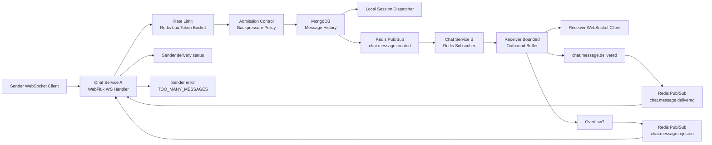

# Reactive Chat Service Architecture

## Summary

`reactive-chat-service` проектируется как реактивный WebSocket chat-service на Kotlin + Spring WebFlux.

Каждый инстанс сервиса обслуживает свои WebSocket-сессии, MongoDB хранит историю сообщений, а Redis Pub/Sub распространяет события между инстансами.

Ключевая модель доставки:

- `chat.message.created` сначала проходит admission/rate-limit checks, затем сохраняется в MongoDB, затем публикуется в Redis.
- Активные получатели получают сообщение через bounded outbound buffer своей WebSocket-сессии.
- Offline/dropped receiver догоняет историю из MongoDB после reconnect.
- `chat.message.delivered` означает, что сообщение принято в outbound buffer активной сессии получателя.
- Для удаленного overflow используется async reject: sender сначала получает `accepted`, а если другой инстанс не смог поставить сообщение в buffer получателя, sender получает `TOO_MANY_MESSAGES`.

## Service Flow



## Public Contracts

### WebSocket Endpoint

```text
GET /ws/chat?userId={userId}&chatId={chatId}&role={client|operator}
```

### Inbound Events

- `chat.message.created`
- `chat.typing.started`
- `chat.typing.stopped`

### Outbound Events

- `chat.message.accepted`
- `chat.message.created`
- `chat.message.delivered`
- `chat.message.rejected`
- `error`

### Redis Channels

Required channels:

- `chat.message.created`
- `chat.message.delivered`

Additional v1 channel for async backpressure feedback:

- `chat.message.rejected`

### JSON Envelope

Use one JSON envelope for all WebSocket and Redis events:

```json
{
  "eventId": "evt-uuid",
  "correlationId": "client-message-id-or-request-id",
  "eventType": "chat.message.created",
  "chatId": "chat-1",
  "senderId": "client-1",
  "timestamp": "2026-04-12T16:00:00Z",
  "payload": {}
}
```

Incoming `chat.message.created`:

```json
{
  "eventType": "chat.message.created",
  "correlationId": "client-msg-001",
  "chatId": "chat-1",
  "senderId": "client-1",
  "payload": {
    "type": "TEXT",
    "text": "Hello"
  },
  "timestamp": "2026-04-12T16:00:00Z"
}
```

Local admission success response:

```json
{
  "eventType": "chat.message.accepted",
  "correlationId": "client-msg-001",
  "payload": {
    "messageId": "msg-001",
    "status": "ACCEPTED"
  }
}
```

Throttling/backpressure rejection:

```json
{
  "eventType": "error",
  "correlationId": "client-msg-001",
  "payload": {
    "code": "TOO_MANY_MESSAGES",
    "httpStatus": 429,
    "message": "Message rejected by backpressure policy"
  }
}
```

## Data Model

MongoDB collection:

```text
chat_messages
```

Minimum stored message fields:

- `messageId`
- `chatId`
- `senderId`
- `type`
- `payload`
- `createdAt`

MongoDB is the durable source of message history. Redis Pub/Sub is used only for realtime inter-instance propagation.

## Service Components

- `ChatWebSocketHandler`: accepts `/ws/chat`, validates query params, decodes and encodes envelopes.
- `SessionRegistry`: tracks active sessions by `chatId` and `userId` on the current instance.
- `OutboundSessionQueue`: bounded per-session queue implemented with Reactor `Sinks.Many`.
- `BackpressurePolicy`: decides `ACCEPT`, `DROP_EPHEMERAL`, or `REJECT_CRITICAL`.
- `RateLimiterService`: configurable per-user message rate limit using Redis Lua token bucket.
- `MessageService`: validates, persists messages, publishes Redis events, returns accepted/error envelopes.
- `RedisChatEventPublisher`: publishes `created`, `delivered`, and `rejected` events.
- `RedisChatEventSubscriber`: receives events from other instances and routes them to local sessions.
- `MessageRepository`: reactive MongoDB repository for history/reconnect.
- `ChatMetrics`: Micrometer metrics for buffer size, dropped events, reject rate, and delivery latency.

## Message Flow

### Normal Flow

1. Client connects to `/ws/chat?userId=...&chatId=...&role=...`.
2. Sender sends `chat.message.created`.
3. Service checks per-user rate limit.
4. Service checks local admission/backpressure policy.
5. If rejected, sender receives `error` with `TOO_MANY_MESSAGES`; message is not saved or published.
6. If accepted, service saves message to MongoDB.
7. Sender receives `chat.message.accepted`.
8. Service dispatches locally and publishes `chat.message.created` to Redis.
9. Every instance receiving the Redis event attempts delivery to local active sessions for the same `chatId`.
10. If recipient queue accepts the message, service emits `chat.message.delivered`.
11. Origin sender receives delivery status through Redis propagation.

### Overflow Behavior

- Ephemeral events such as typing are dropped first and counted in metrics.
- Critical `chat.message` is never silently dropped.
- If local admission fails before persistence, sender gets immediate `TOO_MANY_MESSAGES`.
- If remote recipient queue is full, remote instance publishes `chat.message.rejected`; origin instance sends async `TOO_MANY_MESSAGES` to sender for the accepted `messageId`.

### Reconnect Behavior

1. Client reconnects with the same `userId` and `chatId`.
2. Service loads recent chat history from MongoDB.
3. Client receives missed persisted `chat.message` events.
4. Ephemeral events are not replayed.

## Backpressure And Metrics

Configurable properties:

- `chat.outbound.buffer-size`, default for v1: `256` events per WebSocket session.
- `chat.rate-limit.capacity`, default for v1: `20`.
- `chat.rate-limit.refill-tokens`, default for v1: `20`.
- `chat.rate-limit.refill-period`, default for v1: `1s`.
- `chat.history.reconnect-limit`, default for v1: `100` recent messages.
- `chat.delivery.latency.sla-p95-ms`, target: `250`.

Metrics:

- `chat_ws_sessions_active`
- `chat_outbound_buffer_size`
- `chat_outbound_events_dropped_total`
- `chat_messages_rejected_total`
- `chat_messages_reject_rate`
- `chat_delivery_latency_seconds`
- `chat_redis_events_published_total`
- `chat_redis_events_consumed_total`

## Test Plan

Unit tests:

- ephemeral events are dropped first on buffer pressure;
- critical messages are rejected with `TOO_MANY_MESSAGES`;
- rate limit rejects excessive sender traffic;
- rate limiter works in fail-closed mode when Redis backend is unavailable;
- `delivered` is emitted only after queue acceptance.

Integration tests with Testcontainers:

- MongoDB persistence before Redis publish;
- Redis Pub/Sub delivery between two service instances;
- async remote overflow rejection from instance B back to sender on instance A;
- reconnect loads message history from MongoDB.

Load tests:

- `ws-burst.js` verifies stable behavior under burst;
- add slow-consumer scenario to force outbound buffer overflow;
- add reconnect scenario to verify history catch-up;
- collect before/after metrics for latency, drops, rejects, and memory stability.

## Assumptions

- v1 uses Redis Pub/Sub only for inter-instance chat events, not as durable message storage.
- v1 uses Redis Lua script execution for atomic distributed token bucket decisions.
- MongoDB is the durable source of message history.
- `chat.message.delivered` means accepted into receiver outbound queue, not client-level ack.
- Strict pre-persistence fail-fast for a recipient connected to another service instance is intentionally out of scope for v1 because it requires request/reply or reservation semantics beyond plain Pub/Sub.
- The architecture document is stored separately from `README.md`.
