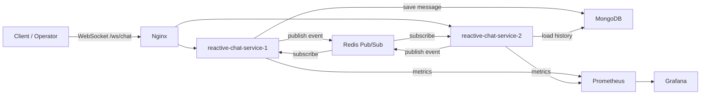

# reactive-chat-service

Pet-проект реактивного chat backend для демонстрации проектирования low-latency WebSocket-сервиса, horizontal scaling, backpressure, rate limiting, observability и load testing.

## 1. Проблема, которую решает проект

В чат-системах важно одновременно решать несколько инженерных задач:

- доставлять сообщения пользователям с low latency;
- поддерживать большое количество параллельных WebSocket-соединений;
- поддерживать horizontal scaling в несколько инстансов без привязки всех участников чата к одному процессу;
- не терять критичные сообщения при реконнекте клиента;
- защищать сервис от всплесков нагрузки, медленных потребителей и агрессивных отправителей;
- иметь метрики, по которым можно увидеть деградацию до того, как сервис станет недоступен.

`reactive-chat-service` моделирует backend для customer-support/live-chat сценария: клиент и оператор подключаются к одному `chatId`, отправляют сообщения и typing-события, получают статусы обработки и могут восстановить последнюю историю после переподключения.

## 2. Решение, которое предлагается в рамках проекта

Сервис построен на Spring WebFlux и реактивных драйверах MongoDB/Redis. Основной транспорт для клиентов - WebSocket endpoint `/ws/chat`.

Ключевая идея решения:

1. Клиент подключается к WebSocket с параметрами `userId`, `chatId`, `role`.
2. Инстанс сервиса регистрирует WebSocket-сессию в локальном in-memory registry.
3. При подключении клиенту отдается последняя история сообщений из MongoDB.
4. Новое критичное сообщение сначала проходит Redis token-bucket rate limiter, затем сохраняется в MongoDB.
5. После сохранения сервис публикует событие в Redis Pub/Sub.
6. Все инстансы получают событие из Redis и доставляют его только тем WebSocket-сессиям, которые находятся на данном инстансе и принадлежат нужному `chatId`.
7. Отправитель получает статусные события `accepted`, `delivered` или `rejected`.
8. Некритичные события, например `typing`, доставляются как ephemeral-события и могут быть отброшены при backpressure.



## 3. Компоненты системы

| Компонент | Назначение |
| --- | --- |
| Spring WebFlux WebSocket | Неблокирующая обработка WebSocket-соединений и входящих событий. |
| `ChatWebSocketHandler` | Собирает входящий и исходящий pipeline для WebSocket-сессии. |
| `SessionRegistry` | Хранит активные WebSocket-сессии текущего инстанса, группирует их по `chatId`. |
| `SessionOutboundDispatcher` | Раскладывает отправку сообщений по partitioned worker pool, чтобы снизить contention при большом количестве сессий. |
| `BoundedBackpressureQueue` | Ограничивает outbound-буфер каждой сессии и применяет policy для медленных клиентов. |
| MongoDB | Персистентное хранилище критичных chat-сообщений и источник истории при reconnect. |
| Redis Pub/Sub | Межинстансная доставка событий: один инстанс принимает сообщение, все инстансы получают событие и доставляют локальным подписчикам. |
| Redis token bucket | Распределенный rate limiter на Lua-скрипте с атомарным consume/refill. |
| Nginx | Балансирует WebSocket-подключения между двумя инстансами сервиса. |
| Prometheus + Grafana | Сбор и визуализация метрик WebSocket-сессий, доставки, rate limit, backpressure и Redis Pub/Sub. |
| k6 | WebSocket load testing scenarios: smoke, burst, multi-chat. |

## 4. Technology stack

### Runtime and build

| Технология | Версия / источник |
| --- | --- |
| Kotlin | `2.0.21` |
| JVM toolchain | Java `17` |
| Docker JVM image | `eclipse-temurin:17-jdk` для build stage, `eclipse-temurin:17-jre` для runtime stage |
| Spring Boot | `3.5.7` |
| Gradle Wrapper | `9.0` |
| Dependency management | Spring Boot BOM `3.5.7` + Mongock BOM `5.5.1` |

### Application libraries

| Библиотека / starter | Назначение | Версия |
| --- | --- | --- |
| Spring WebFlux | Reactive HTTP/WebSocket runtime | managed by Spring Boot `3.5.7` |
| Spring Data Redis Reactive | Reactive Redis client и Redis Pub/Sub | managed by Spring Boot `3.5.7` |
| Spring Data MongoDB Reactive | Reactive MongoDB persistence | managed by Spring Boot `3.5.7` |
| Spring Boot Actuator | Health checks, metrics endpoints, Prometheus endpoint | managed by Spring Boot `3.5.7` |
| Micrometer Prometheus Registry | Export metrics в Prometheus format | managed by Spring Boot `3.5.7` |
| Jackson Kotlin Module | JSON serialization/deserialization для Kotlin DTO | managed by Spring Boot `3.5.7` |
| Kotlin Reflect | Kotlin reflection support для Spring/Kotlin интеграции | `2.0.21` |
| `spring-boot-mongo-migration-starter` | Локальный starter для MongoDB migrations | local project module |
| Mongock | MongoDB migration engine, используется через локальный starter | BOM `5.5.1` |

### Load testing and infrastructure

| Инструмент | Назначение | Версия |
| --- | --- | --- |
| k6 | WebSocket load testing | external CLI |
| MongoDB Docker image | Persistent message storage | `mongo:7.0` |
| Redis Docker image | Pub/Sub и distributed rate limiter | `redis:7.2-alpine` |
| Nginx Docker image | WebSocket reverse proxy / load balancing | `nginx:1.27-alpine` |
| Prometheus Docker image | Metrics collection | `prom/prometheus:v2.55.1` |
| Grafana Docker image | Metrics dashboard | `grafana/grafana:11.3.0` |

## 5. Patterns and engineering approaches

### Reactive end-to-end

Сервис использует Spring WebFlux, Reactor, reactive Redis и reactive MongoDB. Это позволяет держать большое количество WebSocket-соединений без модели "thread per connection" и не блокировать event loop на I/O-операциях.

### Horizontal scaling via Redis Pub/Sub

WebSocket-сессии находятся в памяти конкретного инстанса, но события публикуются в Redis Pub/Sub. Благодаря этому инстансы не должны знать друг о друге напрямую:

- сообщение может быть принято на `reactive-chat-service-1`;
- участник того же чата может быть подключен к `reactive-chat-service-2`;
- событие пройдет через Redis и будет доставлено локальным сессиям на обоих инстансах.

Такой подход хорошо демонстрирует horizontal scaling stateful WebSocket-сервиса без sticky sessions как обязательного требования.

### Fault tolerance

В проекте реализованы несколько уровней защиты:

- Docker Compose поднимает два инстанса приложения за Nginx.
- Контейнеры MongoDB, Redis, сервисов, Prometheus и Grafana имеют `restart: unless-stopped`.
- Nginx проксирует WebSocket upgrade и распределяет соединения между healthy-инстансами.
- Health checks не пускают трафик на сервис до готовности MongoDB/Redis и самого приложения.
- Redis subscriber использует `retry()` после ошибки подписки.
- При reconnect клиент получает последние сообщения из MongoDB, поэтому критичные события не зависят только от WebSocket-соединения.
- Rate limiter работает в fail-closed режиме: если Redis backend для rate limit недоступен, запрос отклоняется, чтобы не открыть сервис для неконтролируемой нагрузки.
- Outbound queue ограничена по размеру, поэтому медленный клиент не может бесконечно накапливать память внутри процесса.

### Backpressure and slow consumers

Для каждой WebSocket-сессии создается bounded outbound queue. События имеют приоритет:

- `CRITICAL` - сообщения и статусы, которые нельзя молча потерять;
- `EPHEMERAL` - временные события вроде `typing`.

Если буфер переполнен:

- ephemeral-событие отбрасывается;
- critical-событие может вытеснить уже накопленное ephemeral-событие;
- если в очереди нет ephemeral-событий, critical-событие получает reject path.

Это защищает сервис от сценария, когда один медленный потребитель начинает удерживать память и ухудшать latency для остальных клиентов.

### Low latency

Low latency достигается за счет комбинации решений:

- неблокирующий WebSocket pipeline на Reactor;
- reactive MongoDB/Redis клиенты без блокировки worker threads;
- локальная доставка WebSocket-событий через in-memory session registry;
- Redis Pub/Sub как легкий межинстансный event bus;
- partitioned outbound dispatcher: сессия закрепляется за worker по hash от `sessionId`, что уменьшает конкуренцию при отправке;
- bounded queues: система быстрее применяет backpressure вместо бесконтрольного роста очередей;
- индекс MongoDB `chatId + payload.createdAt DESC` для быстрого чтения истории при reconnect;
- typing-события не пишутся в MongoDB и не блокируют критичный путь сохранения сообщений.

### Rate limiting with token bucket

Rate limiter реализован на Redis Lua script по алгоритму token bucket. Для каждого пользователя хранится bucket с количеством токенов и временем последнего refill.

Параметры по умолчанию:

- capacity: `20`;
- refill: `20` tokens / `1s`;
- TTL bucket key: `2m`;
- key prefix: `chat:rate-limit:user`;
- Redis backend failure mode: fail-closed.

### Observability

Сервис экспортирует Actuator и Prometheus metrics. В проекте есть готовый Grafana dashboard.

Основные метрики:

- `chat_ws_sessions_active` - активные WebSocket-сессии на инстансе;
- `chat.delivery.latency` - latency от создания сообщения до попадания в outbound queue получателя;
- `chat_outbound_buffer_size` - размер outbound-буферов;
- `chat_outbound_events_dropped_total` - отброшенные события по priority;
- `chat_messages_rejected_total` и `chat_messages_reject_rate` - rejected path;
- Redis Pub/Sub publish/consume metrics;
- rate limiter allowed/rejected/backend error metrics.

## 6. Структура проекта

```text
reactive-chat-service
├── Dockerfile
├── README.md
├── TODO.md
├── build.gradle.kts
├── docker-compose.yml
├── deploy
│   ├── grafana
│   │   ├── dashboards
│   │   │   └── reactive-chat-service.json
│   │   └── provisioning
│   │       ├── dashboards
│   │       │   └── dashboards.yml
│   │       └── datasources
│   │           └── prometheus.yml
│   ├── nginx
│   │   └── nginx.conf
│   └── prometheus
│       └── prometheus.yml
├── load-tests
│   ├── README.md
│   └── scenarios
│       ├── ws-burst.js
│       ├── ws-multi-chat.js
│       └── ws-smoke.js
└── src
    ├── main
    │   ├── kotlin/com/ilchern/reactivechatservice
    │   │   ├── application
    │   │   │   ├── event
    │   │   │   ├── history
    │   │   │   ├── message
    │   │   │   ├── notification
    │   │   │   └── ratelimit
    │   │   ├── config
    │   │   ├── handler
    │   │   ├── infrastructure
    │   │   │   ├── event
    │   │   │   ├── metrics
    │   │   │   ├── persistence/mongo
    │   │   │   ├── redis
    │   │   │   └── websocket
    │   │   ├── migration
    │   │   ├── model
    │   │   │   ├── api
    │   │   │   ├── domain
    │   │   │   └── dto
    │   │   └── ReactiveChatServiceApplication.kt
    │   └── resources
    │       ├── application-docker.yaml
    │       ├── application-local.yaml
    │       ├── application.yaml
    │       └── scripts
    │           └── token_bucket.lua
    └── test
        └── kotlin/com/ilchern/reactivechatservice
```

## 7. Load testing

Load tests находятся в `load-tests/scenarios` и запускаются через k6.

### Тестовый стенд

Текущая машина, на которой планируется прогон:

| Параметр | Значение |
| --- | --- |
| Machine | MacBook Pro |
| Chip | Apple M3 Pro |
| CPU | 12 cores: 6 performance + 6 efficiency |
| RAM | 18 GB |
| OS | macOS 26.2, build 25C56 |
| Service runtime | Docker Compose: 2 app instances + Nginx + MongoDB + Redis + Prometheus + Grafana |

Перед публикацией итоговых цифр стоит дополнительно зафиксировать:

- версию Docker Desktop;
- выделенные Docker CPU/RAM resources;
- версию JDK;
- версию k6;
- лимиты контейнеров, если они задавались отдельно.

### Конфигурации запуска сервиса

#### Docker demo stack

```bash
cd reactive-chat-service
docker compose up --build
```

Состав стенда:

- `reactive-chat-service-1`;
- `reactive-chat-service-2`;
- `nginx` на `localhost:8080`;
- `mongo:7.0`;
- `redis:7.2-alpine`;
- `prometheus` на `localhost:9090`;
- `grafana` на `localhost:3000`.

#### Локальный одиночный инстанс

```bash
./gradlew :reactive-chat-service:bootRun --args='--spring.profiles.active=local'
```

Endpoint по умолчанию: `ws://localhost:8081/ws/chat`.

### Сценарии k6

#### Smoke

Цель: проверить базовый happy path перед тяжелыми тестами.

Проверяется:

- WebSocket handshake;
- отправка typing events;
- отправка двух сообщений;
- `chat.message.accepted` для отправителя;
- `chat.message.created` для получателя.

Команда:

```bash
k6 run reactive-chat-service/load-tests/scenarios/ws-smoke.js
```

Результаты:

| Run | Конфигурация | Connections | Messages sent | Accepted | Created received | Typing received | Errors | p95 connect latency | p99 connect latency | Итог |
| --- | --- | ---: | ---: | ---: | ---: | ---: | ---: | ---: | ---: | --- |
| 2026-04-23, smoke | receiver + sender | 2 | 4 | 2 | 2 | 2 | 0 | 10.1ms | TBD | PASS |

Дополнительные метрики прогона:

- WebSocket handshakes: `2 / 2`, `checks_succeeded=100%`;
- `ws_connecting`: avg `9.76ms`, med `9.76ms`, p90 `10.06ms`, p95 `10.1ms`, max `10.13ms`;
- `ws_msgs_sent=4`, `ws_msgs_received=8`;
- `ws_smoke_sender_accepted_total=2`;
- `ws_smoke_receiver_created_total=2`;
- `ws_smoke_receiver_typing_total=2`.

Вывод: smoke-сценарий подтверждает базовый WebSocket happy path: sender и receiver успешно подключаются, отправитель получает `accepted`, получатель получает message-created и typing events.

#### Burst

Цель: проверить поведение при резком всплеске сообщений, rate limiter и rejected path.

Метрики сценария:

- `ws_burst_messages_sent_total`;
- `ws_burst_accepted_total`;
- `ws_burst_rejected_total`;
- `ws_burst_error_total`;
- `ws_burst_connection_errors_total`;
- `ws_burst_response_latency_ms`.

Базовая команда:

```bash
VUS=50 DURATION=30s MESSAGES_PER_CONNECTION=100 \
  k6 run reactive-chat-service/load-tests/scenarios/ws-burst.js
```

Результаты:

| Run | VUs | Duration | Messages/conn | Send interval | Sessions | Sent | Accepted | Rejected | Error events | Conn errors | p95 response latency | p99 response latency | Итог |
| --- | ---: | --- | ---: | ---: | ---: | ---: | ---: | ---: | ---: | ---: | ---: | ---: | --- |
| 2026-04-23, burst with rate limit | 50 | 30s | 100 | 0ms | 150 | 15000 | 2999 | 115 | 11993 | 0 | 772ms | TBD | PASS |

Дополнительные метрики прогона:

- WebSocket handshakes: `150 / 150`, `checks_succeeded=100%`;
- `ws_connecting`: avg `90.56ms`, med `39.95ms`, p90 `254.65ms`, p95 `271.31ms`, max `409.69ms`;
- `ws_burst_response_latency_ms`: avg `371.19ms`, med `397ms`, p90 `635ms`, p95 `772ms`, max `979ms`;
- `ws_msgs_sent=15000`, `ws_msgs_received=276911`;
- throughput по отправке сообщений: `446.57 msg/s`;
- accepted throughput: `89.28 accepted events/s`;
- `ws_burst_connection_errors_total=0`.

Вывод: при резком burst-профиле `15000` сообщений за 30 секунд сервис не теряет WebSocket-connectivity и не падает под нагрузкой. Rate limiter/backpressure переводят перегрузку в контролируемые `rejected` и `error` responses, при этом connection errors остаются равны `0`, а k6 thresholds проходят.

#### Multi-chat

Цель: проверить изоляцию чатов, fan-out delivery и распределение нагрузки при большом количестве параллельных чатов и пользователей.

Метрики сценария:

- `ws_multi_chat_messages_sent_total`;
- `ws_multi_chat_accepted_total`;
- `ws_multi_chat_received_total`;
- `ws_multi_chat_cross_chat_leaks_total`;
- `ws_multi_chat_self_delivery_leaks_total`;
- `ws_multi_chat_error_events_total`;
- `ws_multi_chat_connection_errors_total`;
- `ws_multi_chat_response_latency_ms`.

Базовая команда:

```bash
CHAT_COUNT=10 USERS_PER_CHAT=5 DURATION=30s MESSAGES_PER_CONNECTION=5 SEND_INTERVAL_MS=100 \
  k6 run reactive-chat-service/load-tests/scenarios/ws-multi-chat.js
```

High-concurrency run:

```bash
CHAT_COUNT=50 USERS_PER_CHAT=10 DURATION=30s MESSAGES_PER_CONNECTION=5 SEND_INTERVAL_MS=100 SEND_START_DELAY_MS=5000 \
  k6 run reactive-chat-service/load-tests/scenarios/ws-multi-chat.js
```

Результаты:

| Run | Chats | Users/chat | Total users | Duration | Messages/conn | Send interval | Sent | Accepted | Received | Cross-chat leaks | Self-delivery leaks | Conn errors | p95 response latency | p99 response latency | Итог |
| --- | ---: | ---: | ---: | --- | ---: | ---: | ---: | ---: | ---: | ---: | ---: | ---: | ---: | ---: | --- |
| 2026-04-23, moderate multi-chat | 10 | 5 | 50 | 30s | 5 | 100ms | 250 | 250 | 1000 | 0 | 0 | 0 | 24ms | TBD | PASS |
| 2026-04-23, high-concurrency multi-chat | 50 | 10 | 500 | 30s | 5 | 100ms | 2500 | 2500 | 22500 | 0 | 0 | 0 | 334ms | TBD | PASS |

Дополнительные метрики moderate-прогона:

- WebSocket handshakes: `50 / 50`, `checks_succeeded=100%`;
- `ws_connecting`: avg `34.62ms`, p95 `47.2ms`, max `52.99ms`;
- `ws_multi_chat_response_latency_ms`: avg `11.7ms`, med `9ms`, p90 `22ms`, p95 `24ms`, max `33ms`;
- `ws_msgs_sent=250`, `ws_msgs_received=2600`;
- throughput по пользовательским сообщениям: `6.93 msg/s`;
- throughput по fan-out delivery events: `27.74 received events/s`;
- `ws_multi_chat_cross_chat_leaks_total=0`, `ws_multi_chat_self_delivery_leaks_total=0`, `ws_multi_chat_connection_errors_total=0`.

Вывод: при 10 параллельных чатах и 50 одновременных WebSocket-сессиях сервис корректно изолирует чаты, не доставляет сообщения отправителю обратно, не допускает cross-chat leaks и сохраняет p95 response latency на уровне `24ms`.

Дополнительные метрики high-concurrency прогона:

- WebSocket handshakes: `500 / 500`, `checks_succeeded=100%`;
- `ws_connecting`: avg `184.01ms`, med `169.61ms`, p90 `353.81ms`, p95 `388.28ms`, max `458ms`;
- `ws_multi_chat_response_latency_ms`: avg `124.35ms`, med `82ms`, p90 `277ms`, p95 `334ms`, max `402ms`;
- `ws_msgs_sent=2500`, `ws_msgs_received=97500`;
- throughput по пользовательским сообщениям: `68.48 msg/s`;
- throughput по fan-out delivery events: `616.34 received events/s`;
- expected fan-out полностью выполнен: `50 chats * 10 users * 5 messages * 9 receivers = 22500 received events`;
- `ws_multi_chat_cross_chat_leaks_total=0`, `ws_multi_chat_self_delivery_leaks_total=0`, `ws_multi_chat_connection_errors_total=0`.

Вывод: после увеличения Nginx connection limits high-concurrency профиль стабильно проходит с 500 одновременными WebSocket-сессиями. Сервис принимает все `2500` сообщений, доставляет полный fan-out `22500` receiver events, не допускает cross-chat/self-delivery leaks и сохраняет p95 response latency `334ms`.

## Быстрый старт

```bash
cd reactive-chat-service
docker compose up --build
```

WebSocket endpoint:

```text
ws://localhost:8080/ws/chat?userId=client-1&chatId=chat-1&role=client
```

Пример входящего сообщения:

```json
{
  "eventId": "event-1",
  "eventType": "chat.message.created",
  "correlationId": "corr-1",
  "timestamp": "2026-04-22T12:00:00Z",
  "payload": {
    "type": "TEXT",
    "value": "Hello"
  }
}
```

Полезные URLs:

- Health: `http://localhost:8080/actuator/health`
- Prometheus metrics: `http://localhost:8080/actuator/prometheus`
- Prometheus UI: `http://localhost:9090`
- Grafana: `http://localhost:3000`, login/password: `admin/admin`
