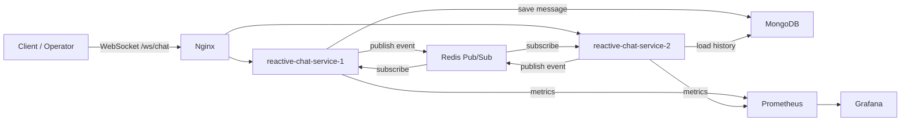

# reactive-chat-service

Reactive low-latency WebSocket chat backend that demonstrates horizontal scaling, Redis Pub/Sub fan-out, MongoDB history replay, token-bucket rate limiting, bounded backpressure queues, observability, and k6 load testing.

## 1. Problem

Chat backends must keep latency low while handling many long-lived WebSocket connections, reconnects, slow consumers, bursty senders, and horizontal scaling across multiple service instances.

This project models a customer-support/live-chat scenario: a client and an operator connect to the same `chatId`, exchange messages and typing events, receive processing statuses, and can restore recent message history after reconnect.

## 2. Solution

The service is built on Spring WebFlux with reactive MongoDB and Redis drivers. Clients connect through the WebSocket endpoint `/ws/chat`.

Main flow:

1. A client connects with `userId`, `chatId`, and `role`.
2. The service registers the WebSocket session in a local in-memory registry.
3. On connect, the client receives recent message history from MongoDB.
4. A critical chat message passes through Redis token-bucket rate limiting.
5. The message is persisted in MongoDB.
6. The service publishes the saved message event to Redis Pub/Sub.
7. All service instances receive the event and deliver it only to local sessions subscribed to the same `chatId`.
8. The sender receives status events such as `accepted`, `delivered`, or `rejected`.
9. Ephemeral events such as `typing` can be dropped under backpressure.



## 3. Components

| Component | Purpose |
| --- | --- |
| Spring WebFlux WebSocket | Non-blocking WebSocket runtime for client connections and incoming events. |
| `ChatWebSocketHandler` | Builds inbound and outbound pipelines for each WebSocket session. |
| `SessionRegistry` | Stores active local sessions and groups them by `chatId`. |
| `SessionOutboundDispatcher` | Dispatches outbound events through a partitioned worker pool to reduce contention. |
| `BoundedBackpressureQueue` | Limits each session's outbound buffer and applies slow-consumer policy. |
| MongoDB | Persistent storage for critical chat messages and reconnect history. |
| Redis Pub/Sub | Cross-instance event fan-out. |
| Redis token bucket | Distributed rate limiter implemented with an atomic Lua script. |
| Nginx | WebSocket reverse proxy and load balancer for two app instances. |
| Prometheus + Grafana | Metrics collection and dashboards. |
| k6 | WebSocket load testing scenarios. |

## 4. Technology Stack

### Runtime and Build

| Technology | Version / source |
| --- | --- |
| Kotlin | `2.0.21` |
| JVM toolchain | Java `17` |
| Docker JVM image | `eclipse-temurin:17-jdk` for build stage, `eclipse-temurin:17-jre` for runtime stage |
| Spring Boot | `3.5.7` |
| Gradle Wrapper | `9.0` |
| Dependency management | Spring Boot BOM `3.5.7` + Mongock BOM `5.5.1` |

### Application Libraries

| Library / starter | Purpose | Version |
| --- | --- | --- |
| Spring WebFlux | Reactive HTTP/WebSocket runtime | managed by Spring Boot `3.5.7` |
| Spring Data Redis Reactive | Reactive Redis client and Redis Pub/Sub | managed by Spring Boot `3.5.7` |
| Spring Data MongoDB Reactive | Reactive MongoDB persistence | managed by Spring Boot `3.5.7` |
| Spring Boot Actuator | Health checks, metrics endpoints, Prometheus endpoint | managed by Spring Boot `3.5.7` |
| Micrometer Prometheus Registry | Prometheus metrics export | managed by Spring Boot `3.5.7` |
| Jackson Kotlin Module | JSON serialization/deserialization for Kotlin DTOs | managed by Spring Boot `3.5.7` |
| Kotlin Reflect | Kotlin reflection support for Spring/Kotlin integration | `2.0.21` |
| `spring-boot-mongo-migration-starter` | Local starter for MongoDB migrations | local project module |
| Mongock | MongoDB migration engine used through the local starter | BOM `5.5.1` |

### Load Testing and Infrastructure

| Tool / image | Purpose | Version |
| --- | --- | --- |
| k6 | WebSocket load testing | external CLI |
| MongoDB Docker image | Persistent message storage | `mongo:7.0` |
| Redis Docker image | Pub/Sub and distributed rate limiter | `redis:7.2-alpine` |
| Nginx Docker image | WebSocket reverse proxy / load balancing | `nginx:1.27-alpine` |
| Prometheus Docker image | Metrics collection | `prom/prometheus:v2.55.1` |
| Grafana Docker image | Metrics dashboard | `grafana/grafana:11.3.0` |

## 5. Patterns and Engineering Approaches

### Reactive End-to-End

The service uses Spring WebFlux, Reactor, reactive Redis, and reactive MongoDB. This avoids a thread-per-connection model and keeps I/O off blocking worker threads.

### Horizontal Scaling via Redis Pub/Sub

WebSocket sessions are local to a service instance, but events are published to Redis Pub/Sub. Every instance receives each event and delivers it only to its local sessions for the target `chatId`. This demonstrates horizontal scaling for a stateful WebSocket service without requiring sticky sessions as the core coordination mechanism.

### Fault Tolerance

The project includes several protection layers:

- Docker Compose starts two app instances behind Nginx.
- MongoDB, Redis, services, Prometheus, and Grafana use restart policies.
- Nginx proxies WebSocket upgrades and balances connections.
- Health checks prevent traffic before dependencies and services are ready.
- Redis subscriber retries after subscription errors.
- Reconnect returns recent messages from MongoDB.
- Rate limiter works in fail-closed mode if Redis is unavailable.
- Per-session outbound queues are bounded.

### Backpressure and Slow Consumers

Each WebSocket session has a bounded outbound queue. Events have priorities:

- `CRITICAL`: chat messages and statuses that should not be silently lost;
- `EPHEMERAL`: temporary events such as `typing`.

When the buffer is full:

- ephemeral events are dropped;
- critical events can evict queued ephemeral events;
- if no ephemeral events can be evicted, the critical event follows a rejected path.

### Low Latency

Low latency is achieved through:

- non-blocking WebSocket pipeline on Reactor;
- reactive MongoDB/Redis clients;
- local delivery through in-memory session registry;
- Redis Pub/Sub as a lightweight cross-instance event bus;
- partitioned outbound dispatcher keyed by `sessionId`;
- bounded queues that apply pressure early;
- MongoDB index on `chatId + payload.createdAt DESC` for fast reconnect history;
- typing events that bypass MongoDB persistence.

### Rate Limiting with Token Bucket

Rate limiting uses a Redis Lua script implementing token bucket. Each user has a bucket with token count and last refill timestamp.

Default parameters:

- capacity: `20`;
- refill: `20` tokens / `1s`;
- bucket key TTL: `2m`;
- key prefix: `chat:rate-limit:user`;
- Redis backend failure mode: fail-closed.

### Observability

The service exports Actuator and Prometheus metrics. A Grafana dashboard is included.

Main metrics:

- `chat_ws_sessions_active`;
- `chat.delivery.latency`;
- `chat_outbound_buffer_size`;
- `chat_outbound_events_dropped_total`;
- `chat_messages_rejected_total`;
- `chat_messages_reject_rate`;
- Redis Pub/Sub publish/consume metrics;
- rate limiter allowed/rejected/backend error metrics.

## 6. Load Testing

Load tests are located in `load-tests/scenarios` and run with k6.

### Test Stand

The documented runs were executed on:

| Parameter | Value |
| --- | --- |
| Machine | MacBook Pro |
| Chip | Apple M3 Pro |
| CPU | 12 cores: 6 performance + 6 efficiency |
| RAM | 18 GB |
| OS | macOS 26.2, build 25C56 |
| Service runtime | Docker Compose: 2 app instances + Nginx + MongoDB + Redis + Prometheus + Grafana |

### Scenarios

#### Smoke

Purpose: verify the basic happy path before heavier tests.

Command:

```bash
k6 run reactive-chat-service/load-tests/scenarios/ws-smoke.js
```

Result:

| Run | Configuration | Connections | Messages sent | Accepted | Created received | Typing received | Errors | p95 connect latency | Result |
| --- | --- | ---: | ---: | ---: | ---: | ---: | ---: | ---: | --- |
| 2026-04-23, smoke | receiver + sender | 2 | 4 | 2 | 2 | 2 | 0 | 10.1ms | PASS |

#### Burst

Purpose: verify behavior under a sudden message spike, rate limiting, and rejected path.

Command:

```bash
VUS=50 DURATION=30s MESSAGES_PER_CONNECTION=100 \
  k6 run reactive-chat-service/load-tests/scenarios/ws-burst.js
```

Result:

| Run | VUs | Duration | Sessions | Sent | Accepted | Rejected | Error events | Conn errors | p95 response latency | Result |
| --- | ---: | --- | ---: | ---: | ---: | ---: | ---: | ---: | ---: | --- |
| 2026-04-23, burst with rate limit | 50 | 30s | 150 | 15000 | 2999 | 115 | 11993 | 0 | 772ms | PASS |

#### Multi-chat

Purpose: verify chat isolation, fan-out delivery, and load distribution across many chats and users.

Commands:

```bash
CHAT_COUNT=10 USERS_PER_CHAT=5 DURATION=30s MESSAGES_PER_CONNECTION=5 SEND_INTERVAL_MS=100 \
  k6 run reactive-chat-service/load-tests/scenarios/ws-multi-chat.js

CHAT_COUNT=50 USERS_PER_CHAT=10 DURATION=30s MESSAGES_PER_CONNECTION=5 SEND_INTERVAL_MS=100 SEND_START_DELAY_MS=5000 \
  k6 run reactive-chat-service/load-tests/scenarios/ws-multi-chat.js
```

Results:

| Run | Chats | Users/chat | Total users | Sent | Accepted | Received | Cross-chat leaks | Self-delivery leaks | Conn errors | p95 response latency | Result |
| --- | ---: | ---: | ---: | ---: | ---: | ---: | ---: | ---: | ---: | ---: | --- |
| 2026-04-23, moderate multi-chat | 10 | 5 | 50 | 250 | 250 | 1000 | 0 | 0 | 0 | 24ms | PASS |
| 2026-04-23, high-concurrency multi-chat | 50 | 10 | 500 | 2500 | 2500 | 22500 | 0 | 0 | 0 | 334ms | PASS |

The high-concurrency run completed with `500` concurrent WebSocket sessions, full expected fan-out, no cross-chat leaks, no self-delivery leaks, and no connection errors.

## 7. Local Run

### Docker Demo Stack

```bash
cd reactive-chat-service
docker compose up --build
```

Stack:

- `reactive-chat-service-1`;
- `reactive-chat-service-2`;
- `nginx` on `localhost:8080`;
- `mongo:7.0`;
- `redis:7.2-alpine`;
- `prometheus` on `localhost:9090`;
- `grafana` on `localhost:3000`.

WebSocket endpoint:

```text
ws://localhost:8080/ws/chat?userId=client-1&chatId=chat-1&role=client
```

Example incoming message:

```json
{
  "eventId": "event-1",
  "eventType": "chat.message.created",
  "correlationId": "corr-1",
  "timestamp": "2026-04-22T12:00:00Z",
  "payload": {
    "type": "TEXT",
    "value": "Hello"
  }
}
```

Useful URLs:

- Health: `http://localhost:8080/actuator/health`
- Prometheus metrics: `http://localhost:8080/actuator/prometheus`
- Prometheus UI: `http://localhost:9090`
- Grafana: `http://localhost:3000`, login/password: `admin/admin`

### Local Single Instance

```bash
./gradlew :reactive-chat-service:bootRun --args='--spring.profiles.active=local'
```

Default endpoint:

```text
ws://localhost:8081/ws/chat
```
