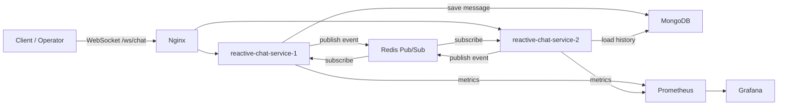

# reactive-chat-service

Reactive low-latency WebSocket chat backend для демонстрации horizontal scaling, Redis Pub/Sub fan-out, MongoDB history replay, token-bucket rate limiting, bounded backpressure queues, observability и k6 load testing.

## 1. Проблема

Chat backend должен сохранять низкую latency при большом количестве долгоживущих WebSocket-соединений, reconnect, медленных потребителях, bursty senders и horizontal scaling между несколькими инстансами.

Проект моделирует customer-support/live-chat сценарий: клиент и оператор подключаются к одному `chatId`, обмениваются сообщениями и typing events, получают статусы обработки и могут восстановить последнюю историю после переподключения.

## 2. Решение

Сервис построен на Spring WebFlux и reactive MongoDB/Redis drivers. Клиенты подключаются через WebSocket endpoint `/ws/chat`.

Основной flow:

1. Клиент подключается с параметрами `userId`, `chatId` и `role`.
2. Сервис регистрирует WebSocket-сессию в локальном in-memory registry.
3. При подключении клиент получает последнюю историю сообщений из MongoDB.
4. Critical chat message проходит Redis token-bucket rate limiting.
5. Сообщение сохраняется в MongoDB.
6. Сервис публикует saved message event в Redis Pub/Sub.
7. Все инстансы получают event и доставляют его только локальным sessions нужного `chatId`.
8. Отправитель получает status events: `accepted`, `delivered` или `rejected`.
9. Ephemeral events, например `typing`, могут быть отброшены при backpressure.



## 3. Компоненты

| Компонент | Назначение |
| --- | --- |
| Spring WebFlux WebSocket | Неблокирующий WebSocket runtime для client connections и incoming events. |
| `ChatWebSocketHandler` | Собирает inbound и outbound pipelines для каждой WebSocket-сессии. |
| `SessionRegistry` | Хранит active local sessions и группирует их по `chatId`. |
| `SessionOutboundDispatcher` | Отправляет outbound events через partitioned worker pool, чтобы снизить contention. |
| `BoundedBackpressureQueue` | Ограничивает outbound buffer каждой session и применяет slow-consumer policy. |
| MongoDB | Persistent storage для critical chat messages и reconnect history. |
| Redis Pub/Sub | Cross-instance event fan-out. |
| Redis token bucket | Distributed rate limiter на atomic Lua script. |
| Nginx | WebSocket reverse proxy и load balancer для двух app instances. |
| Prometheus + Grafana | Metrics collection и dashboards. |
| k6 | WebSocket load testing scenarios. |

## 4. Технологический стек

### Runtime и сборка

| Технология | Версия / источник |
| --- | --- |
| Kotlin | `2.0.21` |
| JVM toolchain | Java `17` |
| Docker JVM image | `eclipse-temurin:17-jdk` для build stage, `eclipse-temurin:17-jre` для runtime stage |
| Spring Boot | `3.5.7` |
| Gradle Wrapper | `9.0` |
| Dependency management | Spring Boot BOM `3.5.7` + Mongock BOM `5.5.1` |

### Библиотеки приложения

| Library / starter | Назначение | Версия |
| --- | --- | --- |
| Spring WebFlux | Reactive HTTP/WebSocket runtime | managed by Spring Boot `3.5.7` |
| Spring Data Redis Reactive | Reactive Redis client и Redis Pub/Sub | managed by Spring Boot `3.5.7` |
| Spring Data MongoDB Reactive | Reactive MongoDB persistence | managed by Spring Boot `3.5.7` |
| Spring Boot Actuator | Health checks, metrics endpoints, Prometheus endpoint | managed by Spring Boot `3.5.7` |
| Micrometer Prometheus Registry | Prometheus metrics export | managed by Spring Boot `3.5.7` |
| Jackson Kotlin Module | JSON serialization/deserialization для Kotlin DTOs | managed by Spring Boot `3.5.7` |
| Kotlin Reflect | Kotlin reflection support для Spring/Kotlin integration | `2.0.21` |
| `spring-boot-mongo-migration-starter` | Локальный starter для MongoDB migrations | local project module |
| Mongock | MongoDB migration engine через локальный starter | BOM `5.5.1` |

### Load testing и инфраструктура

| Tool / image | Назначение | Версия |
| --- | --- | --- |
| k6 | WebSocket load testing | external CLI |
| MongoDB Docker image | Persistent message storage | `mongo:7.0` |
| Redis Docker image | Pub/Sub и distributed rate limiter | `redis:7.2-alpine` |
| Nginx Docker image | WebSocket reverse proxy / load balancing | `nginx:1.27-alpine` |
| Prometheus Docker image | Metrics collection | `prom/prometheus:v2.55.1` |
| Grafana Docker image | Metrics dashboard | `grafana/grafana:11.3.0` |

## 5. Patterns и инженерные подходы

### Reactive end-to-end

Сервис использует Spring WebFlux, Reactor, reactive Redis и reactive MongoDB. Это позволяет не использовать thread-per-connection model и не блокировать worker threads на I/O.

### Horizontal scaling через Redis Pub/Sub

WebSocket sessions локальны для конкретного service instance, но events публикуются в Redis Pub/Sub. Каждый instance получает event и доставляет его только своим local sessions нужного `chatId`. Это демонстрирует horizontal scaling stateful WebSocket service без обязательных sticky sessions как основного coordination mechanism.

### Fault tolerance

В проекте реализованы несколько уровней защиты:

- Docker Compose стартует два app instances за Nginx.
- MongoDB, Redis, services, Prometheus и Grafana используют restart policies.
- Nginx проксирует WebSocket upgrades и балансирует connections.
- Health checks не пускают traffic до готовности dependencies и services.
- Redis subscriber делает retry после subscription errors.
- Reconnect возвращает recent messages из MongoDB.
- Rate limiter работает в fail-closed mode, если Redis недоступен.
- Per-session outbound queues ограничены по размеру.

### Backpressure и медленные потребители

У каждой WebSocket session есть bounded outbound queue. Events имеют priorities:

- `CRITICAL`: chat messages и statuses, которые нельзя молча потерять;
- `EPHEMERAL`: временные events вроде `typing`.

Если buffer переполнен:

- ephemeral events отбрасываются;
- critical events могут вытеснить queued ephemeral events;
- если вытеснить нечего, critical event уходит в rejected path.

### Low latency

Low latency достигается за счет:

- non-blocking WebSocket pipeline на Reactor;
- reactive MongoDB/Redis clients;
- local delivery через in-memory session registry;
- Redis Pub/Sub как lightweight cross-instance event bus;
- partitioned outbound dispatcher по `sessionId`;
- bounded queues, которые рано применяют pressure;
- MongoDB index `chatId + payload.createdAt DESC` для быстрого reconnect history;
- typing events без записи в MongoDB.

### Rate limiting через token bucket

Rate limiting использует Redis Lua script с token bucket. Для каждого user хранится bucket с token count и last refill timestamp.

Параметры по умолчанию:

- capacity: `20`;
- refill: `20` tokens / `1s`;
- bucket key TTL: `2m`;
- key prefix: `chat:rate-limit:user`;
- Redis backend failure mode: fail-closed.

### Observability

Сервис экспортирует Actuator и Prometheus metrics. Grafana dashboard включен в проект.

Основные метрики:

- `chat_ws_sessions_active`;
- `chat.delivery.latency`;
- `chat_outbound_buffer_size`;
- `chat_outbound_events_dropped_total`;
- `chat_messages_rejected_total`;
- `chat_messages_reject_rate`;
- Redis Pub/Sub publish/consume metrics;
- rate limiter allowed/rejected/backend error metrics.

## 6. Load Testing

Load tests находятся в `load-tests/scenarios` и запускаются через k6.

### Тестовый стенд

Документированные прогоны выполнялись на:

| Параметр | Значение |
| --- | --- |
| Machine | MacBook Pro |
| Chip | Apple M3 Pro |
| CPU | 12 cores: 6 performance + 6 efficiency |
| RAM | 18 GB |
| OS | macOS 26.2, build 25C56 |
| Service runtime | Docker Compose: 2 app instances + Nginx + MongoDB + Redis + Prometheus + Grafana |

### Сценарии

#### Smoke

Цель: проверить базовый happy path перед более тяжелыми тестами.

Команда:

```bash
k6 run reactive-chat-service/load-tests/scenarios/ws-smoke.js
```

Результат:

| Run | Конфигурация | Connections | Messages sent | Accepted | Created received | Typing received | Errors | p95 connect latency | Итог |
| --- | --- | ---: | ---: | ---: | ---: | ---: | ---: | ---: | --- |
| 2026-04-23, smoke | receiver + sender | 2 | 4 | 2 | 2 | 2 | 0 | 10.1ms | PASS |

#### Burst

Цель: проверить поведение при резком всплеске сообщений, rate limiting и rejected path.

Команда:

```bash
VUS=50 DURATION=30s MESSAGES_PER_CONNECTION=100 \
  k6 run reactive-chat-service/load-tests/scenarios/ws-burst.js
```

Результат:

| Run | VUs | Duration | Sessions | Sent | Accepted | Rejected | Error events | Conn errors | p95 response latency | Итог |
| --- | ---: | --- | ---: | ---: | ---: | ---: | ---: | ---: | ---: | --- |
| 2026-04-23, burst with rate limit | 50 | 30s | 150 | 15000 | 2999 | 115 | 11993 | 0 | 772ms | PASS |

#### Multi-chat

Цель: проверить изоляцию чатов, fan-out delivery и распределение нагрузки между большим количеством chats/users.

Команды:

```bash
CHAT_COUNT=10 USERS_PER_CHAT=5 DURATION=30s MESSAGES_PER_CONNECTION=5 SEND_INTERVAL_MS=100 \
  k6 run reactive-chat-service/load-tests/scenarios/ws-multi-chat.js

CHAT_COUNT=50 USERS_PER_CHAT=10 DURATION=30s MESSAGES_PER_CONNECTION=5 SEND_INTERVAL_MS=100 SEND_START_DELAY_MS=5000 \
  k6 run reactive-chat-service/load-tests/scenarios/ws-multi-chat.js
```

Результаты:

| Run | Chats | Users/chat | Total users | Sent | Accepted | Received | Cross-chat leaks | Self-delivery leaks | Conn errors | p95 response latency | Итог |
| --- | ---: | ---: | ---: | ---: | ---: | ---: | ---: | ---: | ---: | ---: | --- |
| 2026-04-23, moderate multi-chat | 10 | 5 | 50 | 250 | 250 | 1000 | 0 | 0 | 0 | 24ms | PASS |
| 2026-04-23, high-concurrency multi-chat | 50 | 10 | 500 | 2500 | 2500 | 22500 | 0 | 0 | 0 | 334ms | PASS |

High-concurrency прогон завершился с `500` concurrent WebSocket sessions, полным expected fan-out, без cross-chat leaks, без self-delivery leaks и без connection errors.

## 7. Локальный запуск

### Docker demo stack

```bash
cd reactive-chat-service
docker compose up --build
```

Состав стенда:

- `reactive-chat-service-1`;
- `reactive-chat-service-2`;
- `nginx` на `localhost:8080`;
- `mongo:7.0`;
- `redis:7.2-alpine`;
- `prometheus` на `localhost:9090`;
- `grafana` на `localhost:3000`.

WebSocket endpoint:

```text
ws://localhost:8080/ws/chat?userId=client-1&chatId=chat-1&role=client
```

Пример входящего сообщения:

```json
{
  "eventId": "event-1",
  "eventType": "chat.message.created",
  "correlationId": "corr-1",
  "timestamp": "2026-04-22T12:00:00Z",
  "payload": {
    "type": "TEXT",
    "value": "Hello"
  }
}
```

Полезные URLs:

- Health: `http://localhost:8080/actuator/health`
- Prometheus metrics: `http://localhost:8080/actuator/prometheus`
- Prometheus UI: `http://localhost:9090`
- Grafana: `http://localhost:3000`, login/password: `admin/admin`

### Локальный одиночный инстанс

```bash
./gradlew :reactive-chat-service:bootRun --args='--spring.profiles.active=local'
```

Endpoint по умолчанию:

```text
ws://localhost:8081/ws/chat
```
