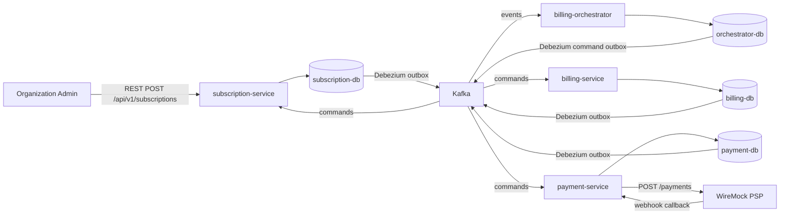
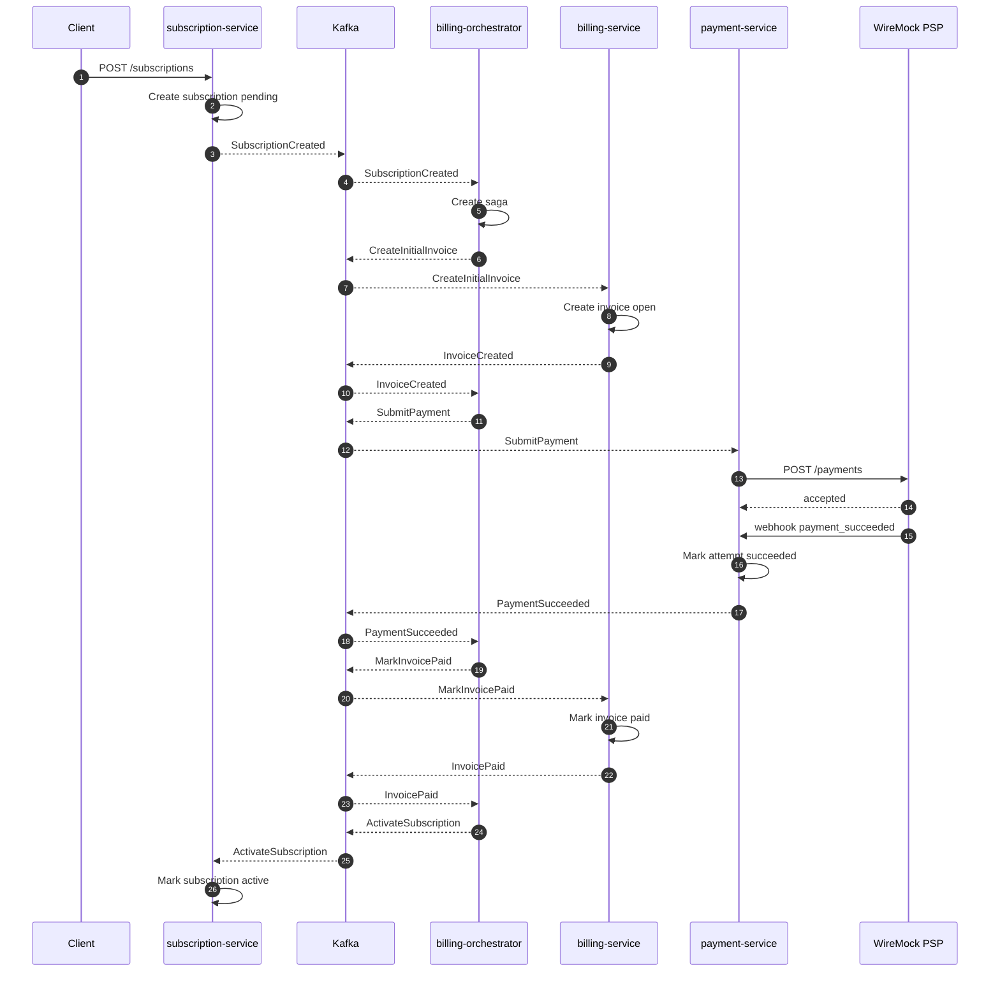
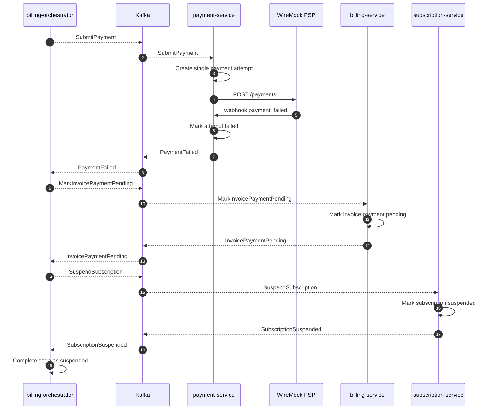

# saas-billing-system

Production-like SaaS billing backend that demonstrates event-driven microservices, saga orchestration, transactional outbox/inbox, idempotency, PostgreSQL database-per-service, Kafka, Debezium CDC, and a mock payment provider.

## 1. Problem

Billing systems must keep subscriptions, invoices, payment attempts, and long-running payment flows consistent across service boundaries without a shared database or distributed transactions.

This project models the initial billing lifecycle for a B2B SaaS product: an organization creates a subscription, the system issues an initial invoice, submits payment, receives a provider outcome, and moves all service-owned entities to a consistent final state.

## 2. Solution

The system is implemented as a set of Kotlin Spring Boot services. Each service owns its PostgreSQL database and writes domain events to a local outbox table in the same transaction as the business change. Debezium publishes those outbox records to Kafka. Cross-service write flows use asynchronous Kafka commands/events, coordinated by `billing-orchestrator`.

Successful initial billing flow:

1. Client sends `POST /api/v1/subscriptions` to `subscription-service`.
2. `subscription-service` creates a pending subscription and emits `SubscriptionCreatedEvent`.
3. Debezium publishes the event to Kafka topic `subscription.events`.
4. `billing-orchestrator` starts a saga and emits `CreateInitialInvoice`.
5. `billing-service` creates an initial invoice and emits `InvoiceCreatedEvent`.
6. `billing-orchestrator` emits `SubmitPayment`.
7. `payment-service` creates a payment attempt and calls WireMock PSP.
8. WireMock returns accepted response and sends a webhook outcome.
9. On success, `payment-service` emits `PaymentSucceededEvent`.
10. `billing-orchestrator` marks the invoice as `PAID`, activates the subscription, and completes the saga.



## 3. Components

| Component | Purpose |
| --- | --- |
| `subscription-service` | Public REST API for subscriptions, subscription lifecycle, idempotency keys, and saga commands `ActivateSubscription` / `SuspendSubscription`. |
| `billing-service` | Initial invoices, amount calculation, and invoice status transitions: `OPEN`, `PAID`, `PAYMENT_PENDING`. |
| `payment-service` | Payment attempts, payment method token references, WireMock PSP integration, provider webhooks, and payment outcome events. |
| `billing-orchestrator` | Saga state machine for initial subscription billing, event handling, command emission, and process state persistence. |
| `billing-contracts` | Avro contracts for Kafka commands/events. |
| `messaging-jpa-starter` | Local reusable starter for inbox/outbox JPA entities and repositories. |
| `e2e-tests` | Full-system tests that start Docker Compose and assert final state in service-owned databases. |
| PostgreSQL | Database-per-service persistence for subscription, billing, payment, and orchestrator contexts. |
| Kafka | Cross-service command/event transport. |
| Debezium Kafka Connect | CDC publisher from outbox tables to Kafka topics. |
| Schema Registry | Avro schema registry. |
| WireMock | Mock payment provider for successful and failed payment outcomes. |
| Kafka UI | Local Kafka diagnostics UI. |

## 4. Technology Stack

### Runtime and Build

| Technology | Version / source |
| --- | --- |
| Kotlin | Root Gradle properties |
| JVM toolchain | Java `17` |
| Docker JVM image | `eclipse-temurin:17-jdk` for build stage, `eclipse-temurin:17-jre` for runtime stage |
| Spring Boot | Root Gradle properties |
| Gradle Wrapper | `9.0` |
| Persistence | Spring Data JPA + Hibernate |
| Migrations | Flyway |
| Messaging contracts | Apache Avro |

### Application Libraries

| Library / starter | Purpose |
| --- | --- |
| Spring Web MVC | REST API and PSP webhook endpoint. |
| Spring Kafka | Kafka command/event consumers and producers. |
| Spring Data JPA | Persistence adapters for service-owned PostgreSQL databases. |
| Spring Boot Actuator | Health endpoints for services and e2e readiness checks. |
| Flyway | PostgreSQL schema migrations. |
| Jackson Kotlin Module | JSON serialization/deserialization for REST DTOs and outbox payloads. |
| Confluent Avro SerDes | Kafka Avro serialization/deserialization. |
| Awaitility | Polling final state in e2e tests. |
| AssertJ | Assertions in integration/e2e tests. |
| Testcontainers | Integration tests for individual services. |

### Local Infrastructure

| Tool / image | Purpose |
| --- | --- |
| `postgres:16` | Four service-owned PostgreSQL databases. |
| `confluentinc/cp-zookeeper:7.9.4` | Zookeeper for local Kafka. |
| `confluentinc/cp-kafka:7.9.4` | Kafka broker. |
| `confluentinc/cp-schema-registry:7.9.4` | Schema Registry. |
| `confluentinc/cp-kafka-connect:7.9.4` | Kafka Connect runtime for Debezium. |
| `debezium/debezium-connector-postgresql:3.1.2` | PostgreSQL CDC connector. |
| `wiremock/wiremock:3.9.2` | Mock PSP and webhook callback simulation. |
| `provectuslabs/kafka-ui:latest` | Kafka diagnostics UI. |

## 5. Patterns and Engineering Approaches

### Database per Service

Each service owns its database:

- `subscription_service_db`;
- `billing_service_db`;
- `payment_service_db`;
- `orchestrator_service_db`.

Services do not read or write other services' tables at runtime. E2E tests are the exception: they assert final full-system state directly in service-owned databases.

### Transactional Outbox via Debezium

Business changes and outbox messages are written in one local PostgreSQL transaction. Debezium PostgreSQL connectors read `outbox_messages` or `command_outbox` and publish records to Kafka.

This avoids the "database commit succeeded, event publish failed" problem without distributed transactions between PostgreSQL and Kafka.

### Inbox Pattern

Kafka consumers use inbox tables to tolerate redelivery. A consumer records `consumer + message_id` and skips duplicate side effects when the same message is delivered again.

### Saga Orchestration

`billing-orchestrator` stores distributed flow state in `billing_sagas`. It does not own subscription, invoice, or payment attempt data. Its responsibility is to react to events and publish the next command.

Initial billing saga supports both happy and failed paths:

- `SubscriptionCreatedEvent` -> `CreateInitialInvoice`;
- `InvoiceCreatedEvent` -> `SubmitPayment`;
- `PaymentSucceededEvent` -> `MarkInvoicePaid` -> `ActivateSubscription`;
- `PaymentFailedEvent` -> `MarkInvoicePaymentPending` -> `SuspendSubscription`;
- final saga status: `COMPLETED`.

### Idempotency

The system protects against duplicates at several levels:

- public create subscription command requires `Idempotency-Key`;
- subscription idempotency key is scoped by organization and operation;
- invoice uniqueness prevents duplicate initial invoices for the same period;
- payment attempt uniqueness protects attempt number per invoice;
- provider webhooks are deduplicated by `provider_event_id`;
- Kafka consumers use inbox uniqueness.

### Deterministic Mock PSP Outcomes

WireMock models the external payment provider:

- any normal token, for example `pm_success`, results in `payment_succeeded`;
- `paymentMethodToken = "pm_fail"` results in `payment_failed`.

## 6. Main Scenarios

### Successful Initial Billing

`POST /api/v1/subscriptions` with a normal payment token:

- creates subscription in `PENDING`;
- creates initial invoice;
- creates and submits payment attempt;
- receives `PaymentSucceededEvent`;
- marks invoice as `PAID`;
- marks subscription as `ACTIVE`;
- completes saga as `COMPLETED`.

Final states:

| Entity | Expected state |
| --- | --- |
| `subscriptions.status` | `ACTIVE` |
| `invoices.status` | `PAID` |
| `payment_attempts.status` | `SUCCEEDED` |
| `billing_sagas.status` | `COMPLETED` |



### Failed Initial Billing

`POST /api/v1/subscriptions` with `paymentMethodToken = "pm_fail"`:

- creates subscription in `PENDING`;
- creates initial invoice;
- creates and submits payment attempt;
- receives `PaymentFailedEvent`;
- marks invoice as `PAYMENT_PENDING`;
- marks subscription as `SUSPENDED`;
- completes saga as `COMPLETED`.

Final states:

| Entity | Expected state |
| --- | --- |
| `subscriptions.status` | `SUSPENDED` |
| `invoices.status` | `PAYMENT_PENDING` |
| `payment_attempts.status` | `FAILED` |
| `billing_sagas.status` | `COMPLETED` |



## 7. Local Run

Start the full environment with Docker Compose:

```bash
cd saas-billing-system
docker compose up -d --build
```

Main endpoints:

| Service | URL |
| --- | --- |
| subscription-service | `http://localhost:8082` |
| billing-service | `http://localhost:8084` |
| billing-orchestrator | `http://localhost:8085` |
| payment-service | `http://localhost:8086` |
| Schema Registry | `http://localhost:8081` |
| Kafka Connect | `http://localhost:8083` |
| WireMock | `http://localhost:8089` |
| Kafka UI | `http://localhost:8090` |

Create a subscription:

```bash
curl -i \
  -X POST http://localhost:8082/api/v1/subscriptions \
  -H 'Content-Type: application/json' \
  -H 'X-Organization-Id: org-demo' \
  -H 'Idempotency-Key: demo-subscription-1' \
  -d '{
    "plan": "PRO",
    "billingPeriod": "MONTHLY",
    "seats": 1,
    "paymentMethodToken": "pm_success"
  }'
```

For the failed path, use:

```json
"paymentMethodToken": "pm_fail"
```

## 8. Testing

Run service-level tests:

```bash
./gradlew :saas-billing-system:subscription-service:test
./gradlew :saas-billing-system:billing-service:test
./gradlew :saas-billing-system:payment-service:test
./gradlew :saas-billing-system:billing-orchestrator:test
```

Run full-system e2e tests:

```bash
./gradlew :saas-billing-system:e2e-tests:test
```

The e2e suite starts Docker Compose before tests and intentionally leaves the environment running after completion. Current e2e scenarios:

- `SuccessfulInitialBillingE2eTest`;
- `FailedInitialBillingE2eTest`.

E2E tests assert final state in:

- `subscription_service_db.subscriptions`;
- `billing_service_db.invoices`;
- `payment_service_db.payment_attempts`;
- `orchestrator_service_db.billing_sagas`.
