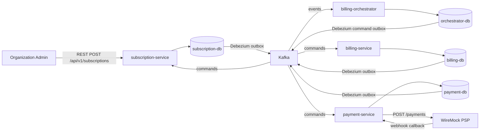
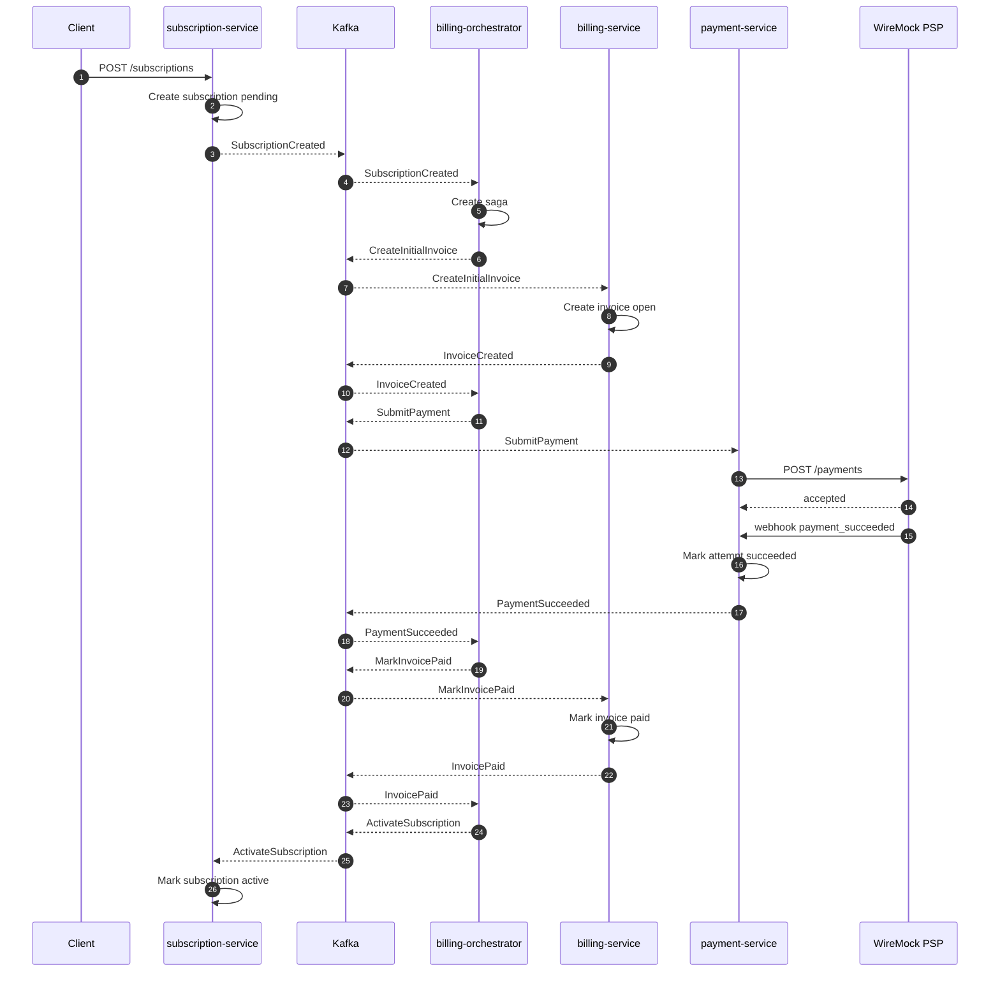
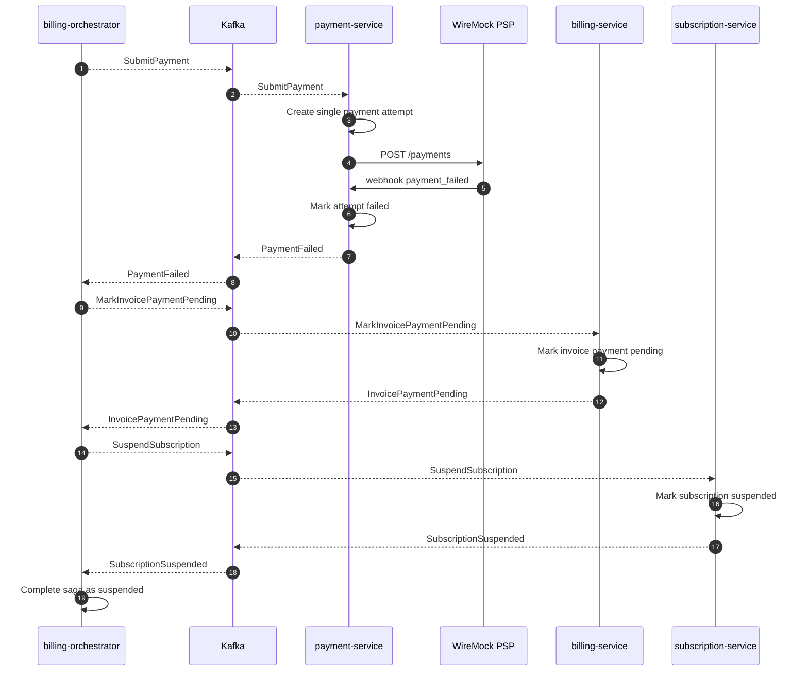

# saas-billing-system

Production-like backend биллинга для SaaS, демонстрирующий event-driven микросервисы, orchestration через saga, transactional outbox/inbox, идемпотентность, PostgreSQL database-per-service, Kafka, Debezium CDC и mock payment provider.

## 1. Проблема

Billing-система должна согласованно вести подписки, счета, попытки оплаты и долгие payment flows между сервисами без общей базы данных и распределенных транзакций.

Проект моделирует initial billing lifecycle для B2B SaaS-продукта: организация создает подписку, система выставляет initial invoice, отправляет платеж, получает результат от provider и переводит все service-owned entities в согласованное финальное состояние.

## 2. Решение

Система реализована как набор Kotlin Spring Boot сервисов. Каждый сервис владеет своей PostgreSQL базой и пишет domain events в локальную outbox table в той же транзакции, что и бизнес-изменение. Debezium публикует outbox records в Kafka. Межсервисные write flows идут через асинхронные Kafka commands/events, а координацию выполняет `billing-orchestrator`.

Flow успешного initial billing:

1. Клиент отправляет `POST /api/v1/subscriptions` в `subscription-service`.
2. `subscription-service` создает pending subscription и публикует `SubscriptionCreatedEvent`.
3. Debezium публикует event в Kafka topic `subscription.events`.
4. `billing-orchestrator` стартует saga и публикует `CreateInitialInvoice`.
5. `billing-service` создает initial invoice и публикует `InvoiceCreatedEvent`.
6. `billing-orchestrator` публикует `SubmitPayment`.
7. `payment-service` создает payment attempt и вызывает WireMock PSP.
8. WireMock возвращает accepted response и отправляет webhook с результатом.
9. При успехе `payment-service` публикует `PaymentSucceededEvent`.
10. `billing-orchestrator` переводит invoice в `PAID`, активирует subscription и завершает saga.



## 3. Компоненты

| Компонент | Назначение |
| --- | --- |
| `subscription-service` | Public REST API для подписок, жизненный цикл subscription, idempotency keys и saga commands `ActivateSubscription` / `SuspendSubscription`. |
| `billing-service` | Initial invoices, расчет суммы, переходы invoice statuses: `OPEN`, `PAID`, `PAYMENT_PENDING`. |
| `payment-service` | Payment attempts, ссылки на payment method tokens, интеграция с WireMock PSP, provider webhooks и payment outcome events. |
| `billing-orchestrator` | Saga state machine для initial subscription billing, обработка events, публикация commands и хранение process state. |
| `billing-contracts` | Avro contracts для Kafka commands/events. |
| `messaging-jpa-starter` | Локальный reusable starter для inbox/outbox JPA entities и repositories. |
| `e2e-tests` | Full-system тесты, которые стартуют Docker Compose и проверяют финальное состояние в service-owned databases. |
| PostgreSQL | Database-per-service persistence для subscription, billing, payment и orchestrator contexts. |
| Kafka | Cross-service command/event transport. |
| Debezium Kafka Connect | CDC publisher из outbox tables в Kafka topics. |
| Schema Registry | Avro schema registry. |
| WireMock | Mock payment provider для successful и failed payment outcomes. |
| Kafka UI | Локальная диагностика Kafka. |

## 4. Технологический стек

### Runtime и сборка

| Технология | Версия / источник |
| --- | --- |
| Kotlin | Root Gradle properties |
| JVM toolchain | Java `17` |
| Docker JVM image | `eclipse-temurin:17-jdk` для build stage, `eclipse-temurin:17-jre` для runtime stage |
| Spring Boot | Root Gradle properties |
| Gradle Wrapper | `9.0` |
| Persistence | Spring Data JPA + Hibernate |
| Миграции | Flyway |
| Messaging contracts | Apache Avro |

### Библиотеки приложения

| Library / starter | Назначение |
| --- | --- |
| Spring Web MVC | REST API и PSP webhook endpoint. |
| Spring Kafka | Kafka command/event consumers и producers. |
| Spring Data JPA | Persistence adapters для service-owned PostgreSQL databases. |
| Spring Boot Actuator | Health endpoints для сервисов и e2e readiness checks. |
| Flyway | PostgreSQL schema migrations. |
| Jackson Kotlin Module | JSON serialization/deserialization для REST DTOs и outbox payloads. |
| Confluent Avro SerDes | Kafka Avro serialization/deserialization. |
| Awaitility | Polling final state в e2e tests. |
| AssertJ | Assertions в integration/e2e tests. |
| Testcontainers | Integration tests отдельных сервисов. |

### Локальная инфраструктура

| Инструмент / image | Назначение |
| --- | --- |
| `postgres:16` | Четыре service-owned PostgreSQL databases. |
| `confluentinc/cp-zookeeper:7.9.4` | Zookeeper для локального Kafka. |
| `confluentinc/cp-kafka:7.9.4` | Kafka broker. |
| `confluentinc/cp-schema-registry:7.9.4` | Schema Registry. |
| `confluentinc/cp-kafka-connect:7.9.4` | Kafka Connect runtime для Debezium. |
| `debezium/debezium-connector-postgresql:3.1.2` | PostgreSQL CDC connector. |
| `wiremock/wiremock:3.9.2` | Mock PSP и симуляция webhook callback. |
| `provectuslabs/kafka-ui:latest` | Kafka diagnostics UI. |

## 5. Паттерны и инженерные подходы

### Database per service

Каждый сервис владеет своей базой:

- `subscription_service_db`;
- `billing_service_db`;
- `payment_service_db`;
- `orchestrator_service_db`.

Сервисы не читают и не пишут чужие таблицы в runtime. E2E tests являются исключением: они проверяют финальное full-system состояние напрямую в service-owned databases.

### Transactional Outbox via Debezium

Бизнес-изменения и outbox messages пишутся в одной локальной PostgreSQL транзакции. Debezium PostgreSQL connectors читают `outbox_messages` или `command_outbox` и публикуют records в Kafka.

Это решает проблему "database commit succeeded, event publish failed" без distributed transactions между PostgreSQL и Kafka.

### Inbox Pattern

Kafka consumers используют inbox tables, чтобы выдерживать redelivery. Consumer записывает `consumer + message_id` и пропускает повторные side effects, если сообщение доставлено снова.

### Saga Orchestration

`billing-orchestrator` хранит distributed flow state в `billing_sagas`. Он не владеет subscription, invoice или payment attempt data. Его ответственность - реагировать на events и публиковать следующий command.

Initial billing saga поддерживает happy и failed paths:

- `SubscriptionCreatedEvent` -> `CreateInitialInvoice`;
- `InvoiceCreatedEvent` -> `SubmitPayment`;
- `PaymentSucceededEvent` -> `MarkInvoicePaid` -> `ActivateSubscription`;
- `PaymentFailedEvent` -> `MarkInvoicePaymentPending` -> `SuspendSubscription`;
- final saga status: `COMPLETED`.

### Idempotency

Система защищается от дублей на нескольких уровнях:

- public create subscription command требует `Idempotency-Key`;
- subscription idempotency key scoped by organization and operation;
- invoice uniqueness не дает создать duplicate initial invoices за тот же period;
- payment attempt uniqueness защищает attempt number per invoice;
- provider webhooks дедуплицируются по `provider_event_id`;
- Kafka consumers используют inbox uniqueness.

### Детерминированные outcomes mock PSP

WireMock моделирует внешний payment provider:

- любой нормальный token, например `pm_success`, дает `payment_succeeded`;
- `paymentMethodToken = "pm_fail"` дает `payment_failed`.

## 6. Основные сценарии

### Успешный initial billing

`POST /api/v1/subscriptions` с нормальным payment token:

- создает subscription в `PENDING`;
- создает initial invoice;
- создает и отправляет payment attempt;
- получает `PaymentSucceededEvent`;
- переводит invoice в `PAID`;
- переводит subscription в `ACTIVE`;
- завершает saga в `COMPLETED`.

Финальные состояния:

| Entity | Ожидаемое состояние |
| --- | --- |
| `subscriptions.status` | `ACTIVE` |
| `invoices.status` | `PAID` |
| `payment_attempts.status` | `SUCCEEDED` |
| `billing_sagas.status` | `COMPLETED` |



### Неуспешный initial billing

`POST /api/v1/subscriptions` с `paymentMethodToken = "pm_fail"`:

- создает subscription в `PENDING`;
- создает initial invoice;
- создает и отправляет payment attempt;
- получает `PaymentFailedEvent`;
- переводит invoice в `PAYMENT_PENDING`;
- переводит subscription в `SUSPENDED`;
- завершает saga в `COMPLETED`.

Финальные состояния:

| Entity | Ожидаемое состояние |
| --- | --- |
| `subscriptions.status` | `SUSPENDED` |
| `invoices.status` | `PAYMENT_PENDING` |
| `payment_attempts.status` | `FAILED` |
| `billing_sagas.status` | `COMPLETED` |



## 7. Локальный запуск

Поднять полное окружение через Docker Compose:

```bash
cd saas-billing-system
docker compose up -d --build
```

Основные endpoints:

| Service | URL |
| --- | --- |
| subscription-service | `http://localhost:8082` |
| billing-service | `http://localhost:8084` |
| billing-orchestrator | `http://localhost:8085` |
| payment-service | `http://localhost:8086` |
| Schema Registry | `http://localhost:8081` |
| Kafka Connect | `http://localhost:8083` |
| WireMock | `http://localhost:8089` |
| Kafka UI | `http://localhost:8090` |

Создать подписку:

```bash
curl -i \
  -X POST http://localhost:8082/api/v1/subscriptions \
  -H 'Content-Type: application/json' \
  -H 'X-Organization-Id: org-demo' \
  -H 'Idempotency-Key: demo-subscription-1' \
  -d '{
    "plan": "PRO",
    "billingPeriod": "MONTHLY",
    "seats": 1,
    "paymentMethodToken": "pm_success"
  }'
```

Для failed path используйте:

```json
"paymentMethodToken": "pm_fail"
```

## 8. Тестирование

Запуск service-level tests:

```bash
./gradlew :saas-billing-system:subscription-service:test
./gradlew :saas-billing-system:billing-service:test
./gradlew :saas-billing-system:payment-service:test
./gradlew :saas-billing-system:billing-orchestrator:test
```

Запуск full-system e2e tests:

```bash
./gradlew :saas-billing-system:e2e-tests:test
```

E2E suite стартует Docker Compose перед тестами и намеренно оставляет окружение поднятым после завершения. Текущие e2e scenarios:

- `SuccessfulInitialBillingE2eTest`;
- `FailedInitialBillingE2eTest`.

E2E tests проверяют финальное состояние в:

- `subscription_service_db.subscriptions`;
- `billing_service_db.invoices`;
- `payment_service_db.payment_attempts`;
- `orchestrator_service_db.billing_sagas`.
