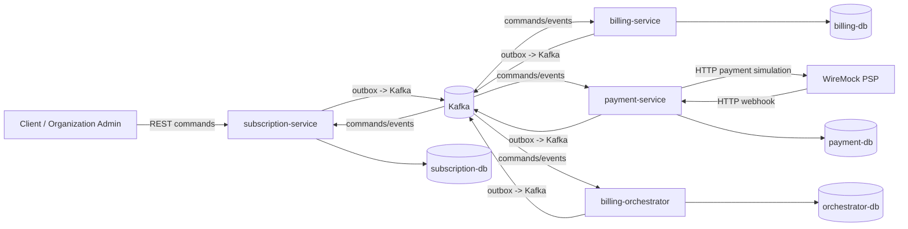
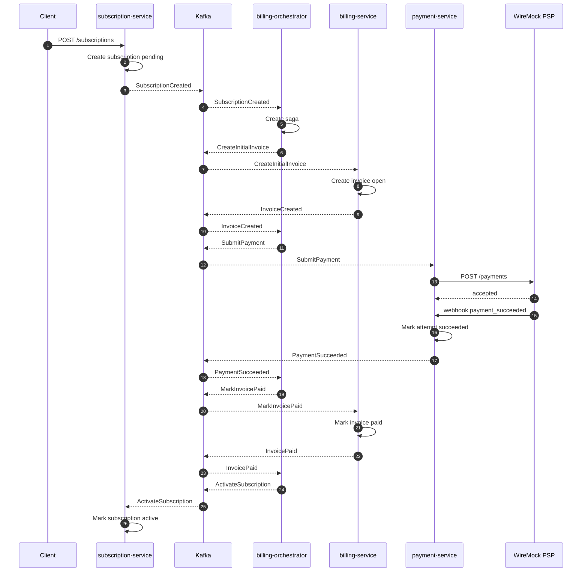
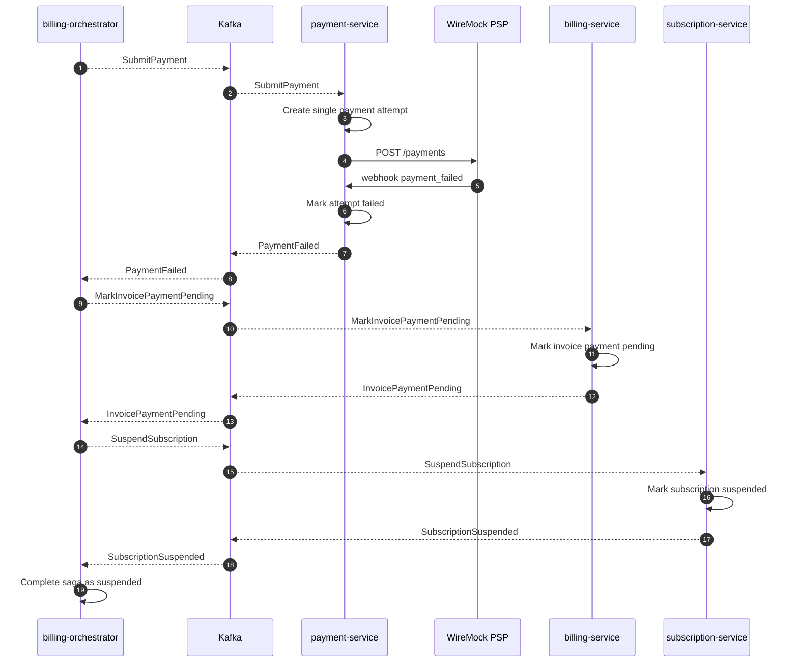

# Mini SaaS Billing System: архитектура решения

## 1. Архитектурная цель

Система проектируется как учебный, но production-like пример event-driven микросервисной billing-платформы. Главный фокус v1: корректная обработка распределенных billing-flow без shared database, с отдельным orchestrator-service, Kafka-событиями, transactional outbox, inbox pattern и идемпотентностью.

Реализация кода начнется отдельным этапом. Этот документ фиксирует целевую архитектуру и решения, от которых нужно отталкиваться при разработке.

## 2. Стек

- Kotlin.
- Java 17.
- Spring Boot.
- Spring MVC для HTTP API.
- Hibernate/JPA для persistence.
- Hibernate EntityGraph для контролируемой загрузки агрегатов и связанных read use cases.
- PostgreSQL, DB per service.
- Flyway для миграций.
- Kafka для async commands/events.
- Docker Compose для локального запуска.
- WireMock как внешний mock payment provider.
- Testcontainers для интеграционных тестов.

Reactive stack и R2DBC не используются в v1. Причина: billing-flow требует простых ACID-транзакций, transactional outbox и изучения Hibernate/JPA/EntityGraph. R2DBC не использует Hibernate persistence context и не поддерживает JPA EntityGraph.

## 3. Контейнеры и границы сервисов

WireMock имитирует внешний payment provider и не считается доменным микросервисом системы.

## 4. Service Ownership

### subscription-service

Ответственность:

- Public REST API для create/change/cancel subscription.
- Header-based identity context: organization, user, role.
- Subscription aggregate и subscription lifecycle.
- Выбор тарифа, billing period и seats.
- Pending changes для следующего billing period.
- Применение saga outcome commands: activate, suspend.

Хранилище:

- `subscription-db`.
- Таблицы subscriptions, subscription_changes, subscription_history, idempotency_keys, outbox_messages, inbox_messages.

### billing-service

Ответственность:

- Invoice aggregate.
- Billing periods.
- Initial и renewal invoices.
- Invoice status transitions.
- Расчет invoice amount по плану, period и seats.
- Due invoice detection для renewal/payment collection flows.

Хранилище:

- `billing-db`.
- Таблицы invoices, invoice_lines, billing_periods, outbox_messages, inbox_messages.

### payment-service

Ответственность:

- Payment attempts.
- Одна payment attempt на initial billing flow.
- Хранение ссылок на payment method tokens.
- Интеграция с WireMock PSP по HTTP.
- Прием PSP webhook callbacks.
- Нормализация PSP outcomes в `PaymentSucceeded` или `PaymentFailed`.
- Защита от повторных webhook/event deliveries.

Хранилище:

- `payment-db`.
- Таблицы payment_attempts, payment_methods, provider_webhook_events, outbox_messages, inbox_messages.

### billing-orchestrator

Ответственность:

- Saga state machine.
- Управление initial subscription activation flow.
- Управление renewal payment flow.
- Реакция на payment failure outcome.
- Публикация команд сервисам и обработка outcome events.
- Reconciliation зависших saga states.

Хранилище:

- `orchestrator-db`.
- Таблицы billing_sagas, saga_steps, outbox_messages, inbox_messages.

Orchestrator не владеет subscription, invoice или payment доменными данными. Он хранит только состояние процесса.

## 5. Communication Model

Public write commands приходят только в `subscription-service` через REST. Межсервисные write-flow выполняются асинхронно через Kafka. REST между сервисами для write-flow не используется.

REST endpoints внутри сервисов допустимы для:

- public commands в `subscription-service`;
- query endpoints для просмотра локального состояния;
- operator/admin diagnostics;
- PSP webhooks в `payment-service`.

Kafka message types делятся на:

- Commands: намерение выполнить действие в другом сервисе.
- Events: факт, который уже произошел и зафиксирован в локальной БД сервиса.

Все Kafka messages должны иметь:

- `messageId`;
- `messageType`;
- `aggregateId`;
- `aggregateType`;
- `correlationId`;
- `causationId`;
- `occurredAt`;
- `schemaVersion`;
- `payload`.

## 6. Kafka Contracts v1

Основные commands:

| Command | Producer | Consumer | Назначение |
| --- | --- | --- | --- |
| `CreateInitialInvoice` | billing-orchestrator | billing-service | Создать initial invoice |
| `CreateRenewalInvoice` | billing-orchestrator | billing-service | Создать renewal invoice |
| `SubmitPayment` | billing-orchestrator | payment-service | Создать payment attempt и отправить его PSP |
| `MarkInvoicePaid` | billing-orchestrator | billing-service | Перевести invoice в paid после успешной оплаты |
| `MarkInvoicePaymentPending` | billing-orchestrator | billing-service | Перевести invoice в ожидание оплаты после отказа PSP |
| `ActivateSubscription` | billing-orchestrator | subscription-service | Активировать подписку после оплаты |
| `SuspendSubscription` | billing-orchestrator | subscription-service | Приостановить pending subscription после отказа оплаты |
| `CancelSubscriptionAtPeriodEnd` | billing-orchestrator | subscription-service | Завершить подписку в конце периода |

Основные events:

| Event | Producer | Consumers | Назначение |
| --- | --- | --- | --- |
| `SubscriptionCreated` | subscription-service | billing-orchestrator | Pending subscription создана |
| `SubscriptionChangeScheduled` | subscription-service | billing-orchestrator, billing-service | Изменение плана/seats запланировано |
| `SubscriptionCancellationRequested` | subscription-service | billing-orchestrator | Отмена запрошена |
| `InvoiceCreated` | billing-service | billing-orchestrator | Invoice создан |
| `InvoicePaymentRequested` | billing-service | billing-orchestrator | Invoice готов к оплате |
| `PaymentSucceeded` | payment-service | billing-orchestrator | Payment attempt успешен |
| `PaymentFailed` | payment-service | billing-orchestrator | Единственная payment attempt неуспешна |
| `InvoicePaid` | billing-service | billing-orchestrator | Invoice закрыт как paid |
| `InvoicePaymentPending` | billing-service | billing-orchestrator | Invoice оставлен в ожидании оплаты после отказа PSP |
| `SubscriptionActivated` | subscription-service | billing-orchestrator | Pending subscription активирована |
| `SubscriptionSuspended` | subscription-service | billing-orchestrator | Pending subscription приостановлена до ручной/повторной оплаты |

## 7. Reliability Baseline

### Transactional Outbox

Каждый сервис, который публикует Kafka messages, записывает доменное изменение и outbox message в одной локальной PostgreSQL-транзакции. Отдельный publisher job читает outbox, публикует сообщение в Kafka и помечает его как published.

Outbox нужен в:

- `subscription-service`;
- `billing-service`;
- `payment-service`;
- `billing-orchestrator`.

### Inbox Pattern

Все write consumers используют inbox table. Consumer в одной транзакции:

1. Проверяет `messageId` и имя consumer.
2. Если сообщение уже обработано, не выполняет side effects.
3. Если сообщение новое, записывает inbox record.
4. Применяет бизнес-изменение.
5. При необходимости записывает outbox messages.
6. Помечает inbox record как processed.

Inbox обязателен для write consumers во всех сервисах. Для read projections допустим lightweight idempotent upsert по `eventId` или `aggregateVersion`.

### Idempotency

- Public REST commands принимают `Idempotency-Key`.
- Business uniqueness защищается unique constraints: invoice per subscription period, payment attempt per invoice в initial flow, saga per business operation.
- Для initial billing flow `payment-service` выполняет одну payment attempt на invoice; повторные business attempts выносятся в отдельный будущий flow.
- PSP webhooks дедуплицируются по provider event id.
- Kafka consumers не полагаются на exactly-once delivery.

### Retry, DLQ и Reconciliation

- Технические ошибки Kafka processing уходят в retry topics с backoff.
- Сообщения после исчерпания retry попадают в DLQ.
- Orchestrator reconciliation job ищет зависшие saga states.
- Billing reconciliation job ищет invoices, застрявшие без ожидаемого billing outcome.
- Payment reconciliation job ищет payment attempts без provider outcome.

## 8. Saga Flows

### Initial subscription activation

### Payment failure, payment pending, suspend

Initial subscription saga имеет два terminal outcome:

- paid path: invoice `PAID`, subscription `ACTIVE`;
- failed payment path: invoice `PAYMENT_PENDING`, subscription `SUSPENDED`.

## 9. Data and Transaction Boundaries

- Каждый сервис владеет только своей БД.
- Межсервисные foreign keys запрещены.
- Cross-service joins запрещены.
- Event payload содержит только данные, нужные consumer для принятия решения.
- Если сервису нужен внешний state для read use case, он строит локальную projection.
- Любое состояние, влияющее на деньги или доступ клиента, изменяется только в локальной ACID-транзакции владельца.

## 10. API Boundaries v1

`subscription-service` public REST:

- `POST /subscriptions` - создать подписку.
- `POST /subscriptions/{subscriptionId}/changes` - запланировать смену плана или seats.
- `POST /subscriptions/{subscriptionId}/cancel` - отменить at period end.
- `GET /subscriptions/{subscriptionId}` - получить состояние подписки.

Обязательные headers:

- `X-Organization-Id`;
- `X-User-Id`;
- `X-User-Role`;
- `Idempotency-Key` для write commands.

`payment-service` webhook REST:

- `POST /webhooks/payment-provider` - принять provider event от WireMock.

Admin/query endpoints могут добавляться внутри каждого сервиса, но не должны становиться межсервисным write API.

## 11. Testing Strategy

- Unit tests:
  - pricing calculation;
  - subscription status transitions;
  - invoice status transitions;
  - saga decision logic;
  - idempotency behavior.
- Integration tests:
  - PostgreSQL Testcontainers для repositories и transactional boundaries;
  - Flyway migrations;
  - transactional outbox write + publisher marking;
  - inbox duplicate delivery handling.
- Kafka tests:
  - command/event serialization;
  - at-least-once duplicate delivery;
  - retry/DLQ behavior for technical failures.
- WireMock contract-like tests:
  - successful payment webhook;
  - failed payment webhook;
  - duplicate webhook event;
  - provider timeout.
- End-to-end scenarios:
  - create subscription -> invoice -> payment success -> active subscription;
  - renewal success;
  - payment failed -> invoice payment pending -> pending subscription suspended;
  - schedule plan/seats change -> apply on next period;
  - cancel at period end -> no renewal.

## 12. Implementation Defaults

- Start with one Gradle multi-module project under `mini-saas-billing-system`.
- Use one Spring Boot application per deployable service.
- Use shared test fixtures only when duplication becomes noisy; do not introduce a shared domain model jar.
- Keep message contracts explicit and versioned.
- Prefer boring synchronous database code inside each service and asynchronous Kafka boundaries between services.
- Keep monetary values as `Long amountMinor` plus `String currency`.
