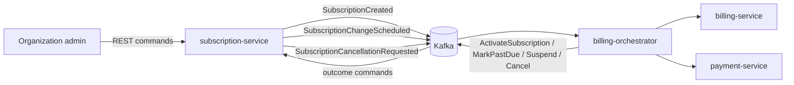

# subscription-service

`subscription-service` owns the public subscription lifecycle for Mini SaaS Billing System.
It is the entry point for organization admins and the source of truth for subscription state,
plan, billing period, seats, pending changes and cancellation intent.

## Component Responsibility

- Accept public REST commands for subscription creation, plan/seat changes and cancellation.
- Read header-based identity context: organization id, user id and idempotency key.
- Maintain the `Subscription` aggregate and its lifecycle.
- Deduplicate public create commands by organization-scoped `Idempotency-Key`.
- Emit subscription domain events through outbox storage.
- Apply billing saga outcomes from `billing-orchestrator`: activate, mark past due, suspend and complete cancellation.

The service does not own invoices, payment attempts or saga state. Those belong to `billing-service`,
`payment-service` and `billing-orchestrator`.

## Interaction Scheme



Current implementation has in-memory repository/idempotency adapters and a no-op outbox adapter so
the module can start without PostgreSQL/Kafka during the first implementation step. The application
and domain ports are shaped for replacing them with JPA repositories, transactional outbox and inbox
processors.

## Use Cases

- Create subscription:
  `POST /api/v1/subscriptions` creates a `pending` subscription and records `SubscriptionCreated`.
- Schedule plan/seats change:
  `POST /api/v1/subscriptions/{id}/changes` stores the latest pending change for the next billing period.
- Cancel at period end:
  `POST /api/v1/subscriptions/{id}/cancel` marks an active or past due subscription as `cancel_at_period_end`.
- Apply saga outcome:
  `POST /api/v1/subscriptions/{id}/outcomes` applies internal lifecycle outcomes from the orchestrator.
- Query subscriptions:
  `GET /api/v1/subscriptions/{id}` and `GET /api/v1/subscriptions` read current local state.

## Package Structure

```text
src/main/kotlin/com/ilchern/saasbilling/subscription/
  SubscriptionServiceApplication.kt

  domain/
    model/          Subscription aggregate, value objects, enums and history entries
    event/          Subscription domain events
    repository/     Domain repository ports

  application/
    command/        Use-case command objects
    handler/        Application handlers and transaction boundary candidates
    port/           Technical ports used by application handlers

  infrastructure/
    config/         Spring beans
    persistence/    Current in-memory/no-op adapters; future JPA/outbox adapters
    web/            REST controllers, DTOs and web mappers
```

Dependency direction follows the service architecture document:

```text
infrastructure -> application -> domain
```

## Stack

- Kotlin 2.0.x.
- Java 17 toolchain.
- Spring Boot from the monorepo dependency platform.
- Spring MVC for REST API.
- Bean Validation for request validation.
- Spring Boot Actuator.

Planned next infrastructure increment:

- Hibernate/JPA persistence with separated entities and domain models.
- PostgreSQL schema and Flyway migrations.
- Transactional outbox publisher.
- Inbox processor for Kafka commands from the orchestrator.

## Domain Models

### Subscription

Main aggregate and source of truth for:

- `id`: internal subscription id.
- `organizationId`: owner organization.
- `status`: lifecycle status.
- `plan`: `BASIC`, `PRO` or `ENTERPRISE`.
- `billingPeriod`: `MONTHLY` or `YEARLY`.
- `seats`: positive seat count.
- `paymentMethodToken`: PSP-safe token reference, never raw card data.
- `pendingChange`: optional plan/seats change for the next billing period.
- `history`: audit trail of critical subscription state changes.

Main invariants:

- New subscription is always created in `PENDING`.
- `ACTIVE` is reached only through an orchestrator outcome after successful initial payment.
- Plan/seats changes are scheduled and do not modify the current paid period immediately.
- Cancellation is at period end and does not delete subscription history.
- `SUSPENDED` can be reached only from `PAST_DUE`.

### PendingSubscriptionChange

Represents the latest change requested by an organization admin. It stores the requested plan,
seat count, actor and timestamp. The current period is not recalculated in v1.

### SubscriptionHistoryEntry

Audit record for important actions such as creation, activation, scheduled change, cancellation,
past due marking and suspension.

### Domain Events

- `SubscriptionCreated`: starts initial billing saga.
- `SubscriptionChangeScheduled`: informs billing/orchestrator that the next renewal should use new terms.
- `SubscriptionCancellationRequested`: informs orchestrator that renewal must stop at period end.

## Gradle

The module is registered as `:saas-billing-system:subscription-service` and imports dependency
versions from the root `:platform-dependencies` platform through the monorepo `subprojects` block.

Useful commands:

```bash
./gradlew :saas-billing-system:subscription-service:compileKotlin
./gradlew :saas-billing-system:subscription-service:bootRun
```
