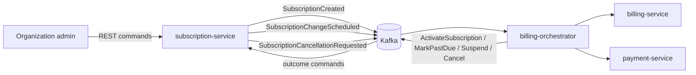

# subscription-service

`subscription-service` owns the public subscription lifecycle for Mini SaaS Billing System.
It is the entry point for organization admins and the source of truth for subscription state,
plan, billing period, seats, pending changes and cancellation intent.

## Component Responsibility

- Accept public REST commands for subscription creation, plan/seat changes and cancellation.
- Read header-based identity context: organization id, user id and idempotency key.
- Maintain the `Subscription` aggregate and its lifecycle.
- Deduplicate public create commands by organization-scoped `Idempotency-Key`.
- Emit subscription domain events through transactional outbox storage for Debezium CDC.
- Consume billing saga outcome commands from `billing-orchestrator` through Kafka inbox processing, starting with `ActivateSubscription`.

The service does not own invoices, payment attempts or saga state. Those belong to `billing-service`,
`payment-service` and `billing-orchestrator`.

## Interaction Scheme



Current implementation persists subscriptions and outbox rows with JPA, publishes domain events
through Debezium Outbox CDC, and consumes orchestrator outcome commands through a Kafka inbox flow.
Incoming `ActivateSubscription` commands are deserialized as Avro `SpecificRecord` contracts from the
shared `:saas-billing-system:billing-contracts` module. Kafka Connect reads committed outbox rows from
PostgreSQL and routes them to Kafka.

## Use Cases

- Create subscription:
  `POST /api/v1/subscriptions` creates a `pending` subscription and records `SubscriptionCreated`.
- Schedule plan/seats change:
  `POST /api/v1/subscriptions/{id}/changes` stores the latest pending change for the next billing period.
- Cancel at period end:
  `POST /api/v1/subscriptions/{id}/cancel-at-period-end` marks an active or past due subscription as `cancel_at_period_end`.
- Apply saga outcome:
  `ActivateSubscription` is consumed from `subscription.commands` as a shared Avro contract and activates a pending subscription through inbox deduplication.
- Query subscriptions:
  `GET /api/v1/subscriptions/{id}` and `GET /api/v1/subscriptions` read current local state.

## Package Structure

```text
src/main/kotlin/com/ilchern/saasbilling/subscription/
  SubscriptionServiceApplication.kt

  domain/
    model/          Subscription aggregate, value objects, enums and history entries
    event/          Subscription domain events
    repository/     Domain repository ports

  application/
    command/        Use-case command objects
    handler/        Application handlers and transaction boundary candidates
    port/           Technical ports used by application handlers

  infrastructure/
    config/         Spring beans
    messaging/      Debezium-compatible outbox storage and Kafka inbox consumers
    persistence/    JPA entities, mappers and repositories
    web/            REST controllers, DTOs and web mappers
```

Dependency direction follows the service architecture document:

```text
infrastructure -> application -> domain
```

## Stack

- Kotlin 2.0.x.
- Java 17 toolchain.
- Spring Boot from the monorepo dependency platform.
- Spring MVC for REST API.
- Bean Validation for request validation.
- Spring Boot Actuator.

Current local runtime uses:

- PostgreSQL for service data and outbox table storage.
- Flyway for schema migrations.
- Kafka as the destination event bus.
- Kafka Connect on `confluentinc/cp-kafka-connect` with Debezium PostgreSQL connector installed.
- Confluent Schema Registry and Avro serialization for Kafka message values.

## Domain Models

### Subscription

Main aggregate and source of truth for:

- `id`: internal subscription id.
- `organizationId`: owner organization.
- `status`: lifecycle status.
- `plan`: `BASIC`, `PRO` or `ENTERPRISE`.
- `billingPeriod`: `MONTHLY` or `YEARLY`.
- `seats`: positive seat count.
- `paymentMethodToken`: PSP-safe token reference, never raw card data.
- `pendingChange`: optional plan/seats change for the next billing period.
- `history`: audit trail of critical subscription state changes.

Main invariants:

- New subscription is always created in `PENDING`.
- `ACTIVE` is reached only through an orchestrator outcome after successful initial payment.
- Plan/seats changes are scheduled and do not modify the current paid period immediately.
- Cancellation is at period end and does not delete subscription history.
- `SUSPENDED` can be reached from `PENDING` for failed initial billing and from `PAST_DUE` for renewal/payment collection flows.
- Kafka write consumers use `inbox_messages` for deduplication and transactional processing.

### PendingSubscriptionChange

Represents the latest change requested by an organization admin. It stores the requested plan,
seat count, actor and timestamp. The current period is not recalculated in v1.

### SubscriptionHistoryEntry

Audit record for important actions such as creation, activation, scheduled change, cancellation,
past due marking and suspension.

### Domain Events

- `SubscriptionCreated`: starts initial billing saga.
- `SubscriptionChangeScheduled`: informs billing/orchestrator that the next renewal should use new terms.
- `SubscriptionCancellationRequested`: informs orchestrator that renewal must stop at period end.
- `ActivateSubscription`: incoming orchestrator command that transitions a pending subscription to active.

## Gradle

The module is registered as `:saas-billing-system:subscription-service` and imports dependency
versions from the root `:platform-dependencies` platform through the monorepo `subprojects` block.
Kafka transport contracts are imported from `:saas-billing-system:billing-contracts`.

## Local CDC Runtime

Start PostgreSQL, ZooKeeper, Kafka, Schema Registry and Kafka Connect:

```bash
docker compose -f saas-billing-system/docker-compose.yml up -d
```

The Docker Compose stack auto-registers connector definitions from `saas-billing-system/deploy/cdc/`,
including `subscription-outbox-connector.json`.

Then run the service locally so Flyway creates the schema and the service can write outbox and inbox rows into PostgreSQL.

Kafka Connect is configured with:

- `StringConverter` for Kafka keys
- `AvroConverter` for Kafka values
- Schema Registry at `http://localhost:8081`
- PostgreSQL database `subscription_service_db`

The Debezium outbox connector expands JSON payload from `outbox_messages.payload` before Avro serialization.

Useful commands:

```bash
./gradlew :saas-billing-system:subscription-service:compileKotlin
./gradlew :saas-billing-system:subscription-service:bootRun
```

## Integration Test Plan

### REST + DB + Outbox

- `POST /subscriptions` creates a `PENDING` subscription.
- Subscription fields are persisted: plan, billing period, seats, organization id and payment method token.
- `SubscriptionCreatedEvent` is written to `outbox_messages`.
- Repeating `POST /subscriptions` with the same `Idempotency-Key` returns the same subscription and does not create a second subscription or duplicate outbox event.

### Application Handler + DB + Outbox

- `ActivateSubscriptionHandler` transitions `PENDING -> ACTIVE` and writes `SubscriptionActivatedEvent`.
- Duplicate activation for an already `ACTIVE` subscription is idempotent and does not write a second event.
- `SuspendSubscriptionHandler` transitions `PENDING -> SUSPENDED` and writes `SubscriptionSuspendedEvent`.
- Duplicate suspension for an already `SUSPENDED` subscription is idempotent and does not write a second event.

### Kafka Listener + Inbox + Handler

- `ActivateSubscription` envelope activates the subscription through `SubscriptionCommandListener`.
- `SuspendSubscription` envelope suspends the subscription through `SubscriptionCommandListener`.
- Duplicate message id for the same consumer is ignored by inbox processing and does not execute the handler side effect twice.
